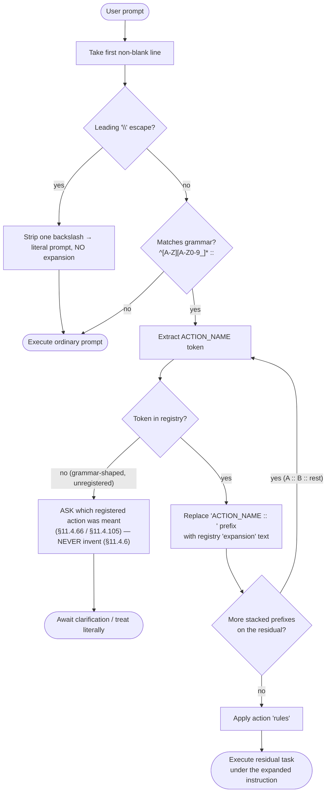
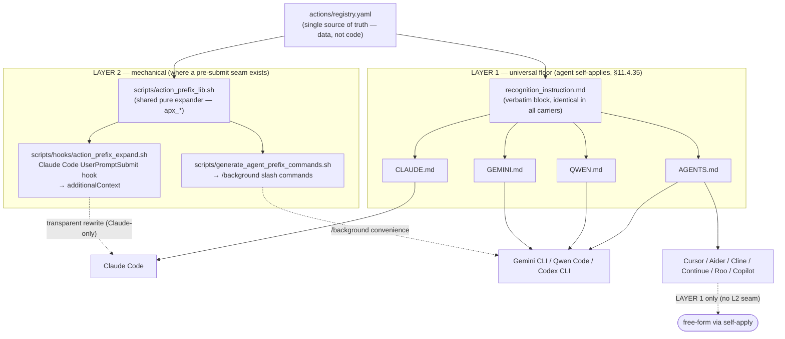
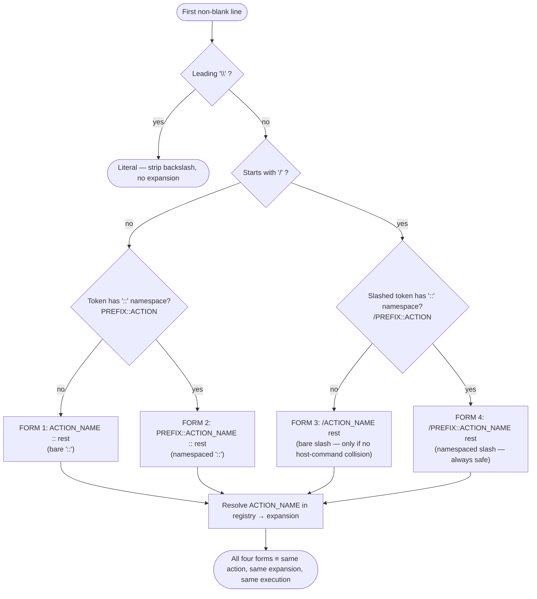

# Action-Prefix System — Diagrams

| Field | Value |
|---|---|
| Revision | 1 |
| Created | 2026-06-09 |
| Last modified | 2026-06-09T00:00:00Z |
| Status | active |
| Scope | Mermaid diagrams for the §11.4.140 action-prefix system |
| Audience | maintainers + engineers (companion to USER_GUIDE.md + MANUAL.md) |
| Inputs | `docs/research/action_prefix_system/{DESIGN.md,GRAMMAR_ADDENDUM.md,IMPLEMENTATION_REPORT.md}` |

> Anti-bluff (§11.4.6): the diagrams depict only the design + the verified
> implementation. All four forms — including the `DEFAULT::` namespace forms 2/4
> — are now implemented and verified (grammar suite 91/0, hook E2E 10/0); none
> remain spec-only.

---

## 1. Expansion flow (prompt → prefix match → registry lookup → expand → execute)

How a single prompt is processed: detect the prefix on the first non-blank line,
handle the escape, look the token up in the registry, replace the prefix with the
expansion, then execute the residual task. This is the C-preprocessor
expand-then-rescan model applied to prompts (DESIGN.md §4).



---

## 2. Two-layer architecture across CLI agents

One shared registry feeds both layers. LAYER 1 (the recognition instruction in
every context carrier) is the universal floor; LAYER 2 is the mechanical upgrade
where an agent exposes a pre-submit seam. Only Claude Code has transparent
mechanical free-form interception (the honest §11.4.3 boundary).



---

## 3. The 4-form grammar decision tree

Which form of the first non-blank line was used. All four forms are
**implemented** and verified (grammar suite 91/0, hook E2E 10/0) per the
GRAMMAR_ADDENDUM; forms 2 and 4 (the `DEFAULT::` namespace) are no longer
spec-only. All four resolve to the same action + expansion by design.



> Legend: all nodes/edges = implemented + verified (forms 1, 2, 3, 4; grammar
> suite 91/0, hook E2E 10/0). The `DEFAULT::` namespace registry keys
> (`default_namespace`/`namespace_separator`/`slash_prefix`/`namespaces`/
> `slash_bare`) are present and `apx_parse_prefix` returns `matched_form` for all
> four forms. See MANUAL.md §4.3 / §7.

---

## 4. Add-a-new-action sequence

Adding an action is a one-row registry edit plus a generator re-run — no code
change in either layer. (DESIGN.md §9 / MANUAL.md §6.)

```mermaid
sequenceDiagram
    actor Dev as Maintainer
    participant Reg as actions/registry.yaml
    participant Gen as generate_agent_prefix_commands.sh
    participant Out as actions/generated/*
    participant Lib as action_prefix_lib.sh
    participant Test as unit test + §1.1 mutation
    participant Doc as docs (§11.4.44 / §11.4.65)

    Dev->>Reg: add one actions[] row\n(name, version, summary≥6 words §11.4.91, expansion, rules?, composes_with?)
    Dev->>Gen: bash scripts/generate_agent_prefix_commands.sh
    Gen->>Lib: apx_validate_registry + apx_lookup_expansion(NEWACTION)
    Lib-->>Gen: expansion (verbatim)
    Gen->>Out: write gemini/newaction.toml, qwen/newaction.toml, codex/newaction.md\n(/newaction = form 3)
    Note over Reg,Out: No edit to the hook OR the library — registry is data, not code.\nLAYER 1 already knows to consult the registry.
    Dev->>Test: add unit test (parses + grammar match + expansion correct)\n+ paired mutation (corrupt expansion → gate FAILs)
    Dev->>Doc: bump revision header; export .html/.pdf at commit time (conductor)
    Note over Dev: Optional — inline the expansion in the LAYER-1 block\nONLY if it must work without registry-file access (like BACKGROUND).
```

---

## 5. Related documents

- [USER_GUIDE.md](USER_GUIDE.md) — end-user guide.
- [MANUAL.md](MANUAL.md) — developer/maintainer manual.
- `docs/research/action_prefix_system/{RESEARCH.md, DESIGN.md, GRAMMAR_ADDENDUM.md,
  IMPLEMENTATION_REPORT.md, RULE_DRAFT.md}` — source design.
- Canonical authority: `Constitution.md` §11.4.140.
