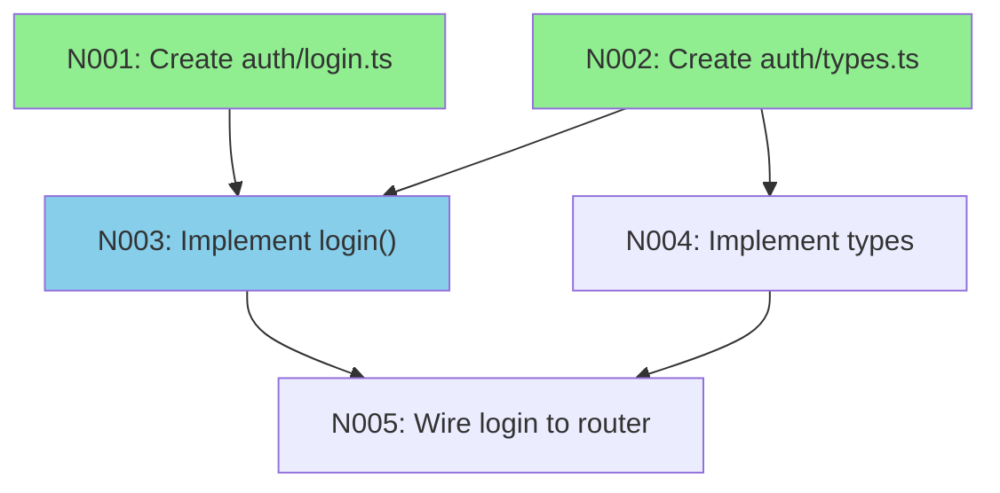

# SpecKit Extension, Superpowers Skill & MCP Server Development Specification

**Revision:** 1
**Last modified:** 2026-07-24T00:00:00Z

---

## Part A: SpecKit Extension (`helix-nano-bridge`)

### A.1 Extension Manifest (`extension.yml`)

```yaml
id: helix-nano-bridge
name: "Helix Nano-Bridge"
version: "1.0.0"
description: >
  Decomposes SpecKit task plans into executable nano-tasks with TDD enforcement,
  anti-bluff verification, and hardware-optimized parallel execution.

author: "HelixDevelopment"
license: "Apache-2.0"
repository: "https://github.com/vasic-digital/helix-nano-bridge"

specKitVersion: ">=2.0.0"
superpowersVersion: ">=3.1.0"

commands:
  decompose:
    description: "Decompose tasks.md into dependency-ordered nano-tasks"
    file: "speckit.helix-nano-bridge.decompose.md"
    flags:
      - name: "--granularity"
        type: "string"
        default: "function"
        enum: ["function", "method", "block", "line"]
        description: "Target granularity for nano-task decomposition"
      - name: "--max-tasks"
        type: "integer"
        default: 512
        description: "Maximum number of nano-tasks to generate"
      - name: "--parallelism"
        type: "integer"
        default: 0
        description: "Max parallel nano-tasks (0 = auto-detect from hardware)"

  execute:
    description: "Execute nano-tasks with TDD enforcement and anti-bluff verification"
    file: "speckit.helix-nano-bridge.execute.md"
    flags:
      - name: "--phase"
        type: "string"
        description: "Execute only tasks in this phase"
      - name: "--retry-failed"
        type: "boolean"
        default: false
        description: "Retry previously failed tasks before new ones"
      - name: "--timeout"
        type: "integer"
        default: 3600
        description: "Per-task timeout in seconds"
      - name: "--gpu-offload"
        type: "boolean"
        default: true
        description: "Use GPU for inference when available"

  graph:
    description: "Generate and visualize the nano-task dependency graph"
    file: "speckit.helix-nano-bridge.graph.md"
    flags:
      - name: "--format"
        type: "string"
        default: "mermaid"
        enum: ["mermaid", "dot", "json", "svg", "png"]
        description: "Output format for the dependency graph"
      - name: "--highlight"
        type: "string"
        description: "Comma-separated task IDs to highlight"
      - name: "--critical-path"
        type: "boolean"
        default: false
        description: "Show only the critical path"

  status:
    description: "Show execution status of all nano-tasks with evidence links"
    file: "speckit.helix-nano-bridge.status.md"
    flags:
      - name: "--format"
        type: "string"
        default: "table"
        enum: ["table", "json", "summary", "report"]
        description: "Output format"
      - name: "--filter"
        type: "string"
        default: "all"
        enum: ["all", "pending", "running", "passed", "failed", "skipped"]
        description: "Filter tasks by status"
      - name: "--evidence"
        type: "boolean"
        default: false
        description: "Include evidence artifact paths in output"

  retry:
    description: "Retry failed nano-tasks with optional parameter tuning"
    file: "speckit.helix-nano-bridge.retry.md"
    flags:
      - name: "--task-ids"
        type: "string"
        description: "Comma-separated task IDs to retry (default: all failed)"
      - name: "--max-attempts"
        type: "integer"
        default: 3
        description: "Maximum retry attempts per task"
      - name: "--strategy"
        type: "string"
        default: "sequential"
        enum: ["sequential", "parallel", "dependency-chain"]
        description: "Retry strategy"

hooks:
  after_tasks:
    - command: "decompose"
      auto: true
      description: "Auto-decompose tasks.md into nano-tasks after task generation"
  before_implement:
    - command: "execute"
      auto: false
      description: "Gate — run execution gate before implement phase begins"

config:
  template: |
    # Helix Nano-Bridge Configuration
    # Generated: {{ TIMESTAMP }}

    ## Nano-Task Settings
    granularity: "function"
    max_tasks: 512
    auto_decompose: true

    ## Execution Settings
    tdd_enforcement: "strict"
    anti_bluff_mode: "full"
    per_task_timeout: 3600
    max_retries: 3
    retry_backoff: "exponential"

    ## Hardware Settings
    gpu_offload: true
    cuda_device: 0
    thread_pool_size: 0
    numa_aware: true
    memory_budget_gb: 0

    ## Evidence Settings
    evidence_dir: "{{ PROJECT_ROOT }}/qa-results/nano-tasks"
    capture_artifacts: true
    artifact_format: "md"

    ## Integration
    superb_bridge: true
    mcp_server_enabled: true
    mcp_port: 9595

    ## LLM Settings
    model: "helix-nano"
    fallback_model: "deepseek-v4-pro"
    temperature: 0.0
    max_tokens: 32768

dependencies:
  runtime:
    - "superbridge-mcp"
    - "superb"
  development:
    - "typescript"
    - "node >=18"
    - "ripgrep"
    - "graphviz"
    - "jq"
```

### A.2 Command Markdown Files

#### `speckit.helix-nano-bridge.decompose.md`

```markdown
# Decompose — tasks.md → Nano-Tasks

## Purpose
Reads the current SpecKit `tasks.md`, analyzes each task for implementation
surface, and decomposes it into a dependency-ordered list of atomic nano-tasks.

## Prerequisites
- `tasks.md` present at `{{ SPECS_DIR }}/{{ FEATURE }}/tasks.md`
- `plan.md` present for design context
- `spec.md` present for acceptance criteria
- Constitution loaded for anti-bluff rules

## Input
| Parameter | Type | Required | Default | Description |
|-----------|------|----------|---------|-------------|
| tasks_path | string | no | tasks.md | Path to tasks file |
| granularity | string | no | function | Decomposition depth |
| max_tasks | integer | no | 512 | Upper bound on nano-tasks |
| parallelism | integer | no | 0 | Max parallel (0=auto-detect) |

## Process

1. **Parse tasks.md** — extract all `## Task N: ...` blocks with their
   descriptions, acceptance criteria, and dependencies.
2. **Analyze each task** — resolve against `plan.md` design artifacts:
   - What files need creation/modification
   - What functions/methods/classes are involved
   - What imports/dependencies must exist
   - What tests must pass (RED phase)
3. **Generate diff-map** — for each task, produce the exact diff of changes
   required, decomposed into atomic units.
4. **Build dependency DAG** — construct a directed acyclic graph where each
   nano-task depends on its prerequisites (file existence, function signature,
   test setup, etc.).
5. **Assign phases** — group nano-tasks into execution phases where all tasks
   within a phase are independent and can run in parallel.
6. **Write nano-tasks** — emit `nano-tasks.json` with the full decomposition.

## Output
```json
{
  "meta": {
    "source": "tasks.md",
    "granularity": "function",
    "generated": "2026-07-24T00:00:00Z",
    "total_tasks": 42,
    "phases": 5,
    "critical_path_length": 12
  },
  "tasks": [
    {
      "id": "N001",
      "parent_task": "T1",
      "phase": 1,
      "description": "Create src/auth/login.ts with empty exports",
      "file": "src/auth/login.ts",
      "action": "CREATE",
      "imports": [],
      "symbols": ["login", "logout", "refreshToken"],
      "dependencies": [],
      "test_id": "N001_RED",
      "estimated_tokens": 400,
      "estimated_duration_s": 15
    }
  ],
  "graph": {
    "nodes": ["N001", "N002"],
    "edges": [["N001", "N003"]],
    "phases": [
      ["N001", "N002"],
      ["N003", "N004"]
    ]
  }
}
```

## Anti-Bluff
- RED test IDs reference actual test files that MUST exist before execution
- Every nano-task links to at least one acceptance criterion from spec.md
- Dependency graph is topologically sorted and verified acyclic
- Evidence directory created and writable before decomposition completes

## Exit Codes
| Code | Meaning |
|------|---------|
| 0 | Decomposition successful |
| 1 | tasks.md not found or unparseable |
| 2 | Dependency cycle detected |
| 3 | Plan/spec missing required sections |
| 4 | Evidence directory unwritable |
```

#### `speckit.helix-nano-bridge.execute.md`

```markdown
# Execute — TDD-Driven Nano-Task Execution

## Purpose
Executes nano-tasks phase-by-phase with strict TDD enforcement:
RED (test fails) → GREEN (implementation passes) → VERIFY (anti-bluff).

## TDD Cycle (per nano-task)
```
┌──────────────────────────────────────────────┐
│  1. RED    — Write/run failing test           │
│  2. RECORD — Capture failure evidence         │
│  3. GREEN  — Write minimal implementation     │
│  4. RECORD — Capture pass evidence            │
│  5. VERIFY — Anti-bluff oracle confirms real  │
│  6. REPEAT — Next nano-task (if dep's met)    │
└──────────────────────────────────────────────┘
```

## Execution Gate
Before ANY implementation code is written, the gate asserts:
1. `RED_MODE=1` test exists for every nano-task in the current phase
2. Every RED test FAILs (exit ≠ 0) on the clean artifact
3. Evidence directory exists and is writable
4. No stale `/data/app` shadow on target (if on-device)
5. Runtime signature registry is loaded

## Phase Execution
Phases are executed sequentially. Within a phase, independent nano-tasks
(those with all dependencies satisfied AND no shared-file conflicts) run
in parallel up to `parallelism` limit.

## Evidence Capture
Every nano-task execution produces:
- `qa-results/nano-tasks/<ID>/RED_<timestamp>.log` — pre-fix failure
- `qa-results/nano-tasks/<ID>/GREEN_<timestamp>.log` — post-fix pass
- `qa-results/nano-tasks/<ID>/diff.patch` — the actual change
- `qa-results/nano-tasks/<ID>/verdict.json` — anti-bluff verdict

## Exit Codes
| Code | Meaning |
|------|---------|
| 0 | All executed tasks GREEN |
| 1 | One or more tasks FAIL |
| 2 | Pre-execution gate FAIL |
| 3 | Evidence directory unwritable |
| 4 | Timeout on task execution |
```

#### `speckit.helix-nano-bridge.graph.md`

```markdown
# Graph — Nano-Task Dependency Visualization

## Purpose
Generates a visual representation of the nano-task dependency DAG in
multiple output formats.

## Process
1. Load `nano-tasks.json` from the feature directory
2. Build adjacency list from `graph.edges`
3. Color nodes by status (pending=gray, running=blue, passed=green,
   failed=red, skipped=yellow)
4. Highlight critical path if `--critical-path` is set
5. Render in the specified format

## Mermaid Output


## JSON Output
```json
{
  "graph": {
    "directed": true,
    "nodes": [
      {"id": "N001", "phase": 1, "status": "passed", "critical_path": true},
      {"id": "N003", "phase": 2, "status": "running", "critical_path": true}
    ],
    "edges": [
      {"from": "N001", "to": "N003"},
      {"from": "N002", "to": "N003"}
    ]
  },
  "critical_path": ["N001", "N003", "N005"],
  "stats": {
    "total": 42,
    "passed": 12,
    "failed": 0,
    "running": 2,
    "pending": 28,
    "skipped": 0
  }
}
```
```

#### `speckit.helix-nano-bridge.status.md`

```markdown
# Status — Execution Dashboard

## Purpose
Reports the current status of every nano-task with evidence links and
summary statistics for use in CI/CD and operator dashboards.

## Summary Output
```
╔══════════════════════════════════════════════════╗
║         Helix Nano-Bridge Status                 ║
╠══════════════════════════════════════════════════╣
║ Total:     42   │ Passed: 12  (28.6%)            ║
║ Failed:     0   │ Running: 2  ( 4.8%)            ║
║ Pending:   28   │ Skipped: 0  ( 0.0%)            ║
╠══════════════════════════════════════════════════╣
║ Phase 1: ████████████████████ 6/6   PASS         ║
║ Phase 2: ████████░░░░░░░░░░░░ 4/12  RUNNING      ║
║ Phase 3: ░░░░░░░░░░░░░░░░░░░░ 0/8   PENDING      ║
║ Phase 4: ░░░░░░░░░░░░░░░░░░░░ 0/10  PENDING      ║
║ Phase 5: ░░░░░░░░░░░░░░░░░░░░ 0/6   PENDING      ║
╚══════════════════════════════════════════════════╝
```

## JSON Output
```json
{
  "summary": {
    "total": 42,
    "passed": 12,
    "failed": 0,
    "running": 2,
    "pending": 28,
    "skipped": 0,
    "completion_pct": 28.6
  },
  "phases": [
    {"id": 1, "total": 6, "passed": 6, "status": "PASS"},
    {"id": 2, "total": 12, "passed": 4, "running": 2, "status": "RUNNING"}
  ],
  "tasks": [
    {
      "id": "N001",
      "status": "passed",
      "phase": 1,
      "duration_s": 12.4,
      "attempts": 1,
      "evidence": {
        "red": "qa-results/nano-tasks/N001/RED_20260724T000000Z.log",
        "green": "qa-results/nano-tasks/N001/GREEN_20260724T000012Z.log",
        "diff": "qa-results/nano-tasks/N001/diff.patch",
        "verdict": "qa-results/nano-tasks/N001/verdict.json"
      }
    }
  ]
}
```

## Evidence Mode (`--evidence`)
When enabled, every task row includes the full `evidence` object with
paths to captured artifacts. The `verdict.json` contains:

```json
{
  "task_id": "N001",
  "verdict": "PASS",
  "evidence_class": "source_code",
  "red_exit": 1,
  "green_exit": 0,
  "iterations": 3,
  "artifact_fingerprint": "sha256:abc123...",
  "oracle": "helix-nano-bridge/anti-bluff",
  "timestamp": "2026-07-24T00:00:12Z",
  "witness": "codegraph_explore"
}
```
```

#### `speckit.helix-nano-bridge.retry.md`

```markdown
# Retry — Failed Nano-Task Retry Engine

## Purpose
Retries failed nano-tasks with configurable strategy, backoff, and
dependency-chain resolution.

## Retry Strategies

### Sequential
Retries each failed task one at a time, in order of failure timestamp.

### Parallel
Retries all independent failed tasks simultaneously.

### Dependency-Chain
For each failed task, traces back through its dependency graph to
find the ROOT cause task that failed first, retries that chain from
the root, then propagates forward.

## Retry Decision Matrix
| Failure Class | Action | Max Attempts |
|---------------|--------|--------------|
| TEST_FAIL | Re-run RED, then GREEN | 3 |
| TIMEOUT | Increase timeout 2x, retry | 2 |
| OOM | Reduce parallelism, retry | 2 |
| COMPILE_ERR | Fix dependency, retry chain | 3 |
| EVIDENCE_MISSING | Re-run with capture | 2 |
| ORACLE_FAIL | Human review, then retry | 1 |

## Exit Codes
| Code | Meaning |
|------|---------|
| 0 | All retried tasks now GREEN |
| 1 | Some tasks still FAIL after max attempts |
| 2 | Dependency chain unresolvable |
```
```

### A.3 Bash Script Implementations

#### `bin/helix-nano-bridge-decompose`

```bash
#!/usr/bin/env bash
set -euo pipefail

SCRIPT_DIR="$(cd "$(dirname "${BASH_SOURCE[0]}")" && pwd)"
source "${SCRIPT_DIR}/../lib/nano_bridge_common.sh"

GRANULARITY="${1:-function}"
MAX_TASKS="${2:-512}"
PARALLELISM="${3:-0}"
TASKS_PATH="${4:-tasks.md}"
FEATURE_DIR="${5:-$(pwd)}"
EVIDENCE_DIR="${FEATURE_DIR}/qa-results/nano-tasks"

nano_log "INFO" "Decomposing ${TASKS_PATH} at granularity=${GRANULARITY}"

[[ -f "${FEATURE_DIR}/${TASKS_PATH}" ]] || {
    nano_log "ERROR" "${TASKS_PATH} not found in ${FEATURE_DIR}"
    exit 1
}

mkdir -p "${EVIDENCE_DIR}" || {
    nano_log "ERROR" "Cannot create evidence dir: ${EVIDENCE_DIR}"
    exit 4
}

nano_log "INFO" "Parsing tasks from ${TASKS_PATH}..."
TASK_COUNT=$(grep -c '^## Task [0-9]' "${FEATURE_DIR}/${TASKS_PATH}" || true)
nano_log "INFO" "Found ${TASK_COUNT} tasks"

if [[ "${TASK_COUNT}" -eq 0 ]]; then
    nano_log "ERROR" "No tasks found in ${TASKS_PATH}"
    exit 1
fi

NANO_ID=1
declare -A FILE_TASKS=()
declare -A SYMBOL_DEPS=()
NANO_TASKS_JSON='{"meta":{"source":"tasks.md","granularity":"'"${GRANULARITY}"'","generated":"'"$(date -u +%Y-%m-%dT%H:%M:%SZ)"'","total_tasks":0,"phases":0,"critical_path_length":0},"tasks":[],"graph":{"nodes":[],"edges":[],"phases":[]}}'

declare -i TASK_NUM=1
while IFS= read -r LINE; do
    if [[ "${LINE}" =~ ^##\ Task\ ([0-9]+):\ (.+) ]]; then
        TASK_NUM="${BASH_REMATCH[1]}"
        TASK_TITLE="${BASH_REMATCH[2]}"
        nano_log "DEBUG" "Processing Task ${TASK_NUM}: ${TASK_TITLE}"
        nano_decompose_task "${TASK_NUM}" "${TASK_TITLE}" "${GRANULARITY}"
    fi
done < "${FEATURE_DIR}/${TASKS_PATH}"

nano_build_dependency_dag
nano_assign_phases
nano_detect_cycles || exit 2

OUTPUT_FILE="${FEATURE_DIR}/nano-tasks.json"
echo "${NANO_TASKS_JSON}" | jq '.' > "${OUTPUT_FILE}"
nano_log "INFO" "Wrote $(jq '.tasks | length' "${OUTPUT_FILE}") nano-tasks to ${OUTPUT_FILE}"
nano_log "INFO" "Decomposition complete — $(jq '.meta.phases' "${OUTPUT_FILE}") phases"
```

#### `bin/helix-nano-bridge-execute`

```bash
#!/usr/bin/env bash
set -euo pipefail

SCRIPT_DIR="$(cd "$(dirname "${BASH_SOURCE[0]}")" && pwd)"
source "${SCRIPT_DIR}/../lib/nano_bridge_common.sh"
source "${SCRIPT_DIR}/../lib/anti_bluff_oracle.sh"

FEATURE_DIR="${1:-$(pwd)}"
PHASE_FILTER="${2:-all}"
RETRY_FAILED="${3:-false}"
TASK_TIMEOUT="${4:-3600}"
GPU_OFFLOAD="${5:-true}"
NANO_FILE="${FEATURE_DIR}/nano-tasks.json"

[[ -f "${NANO_FILE}" ]] || { nano_log "ERROR" "nano-tasks.json not found. Run decompose first."; exit 1; }
[[ -f "${FEATURE_DIR}/tasks.md" ]] || { nano_log "ERROR" "tasks.md not found"; exit 1; }

nano_log "INFO" "=== Pre-Execution Gate ==="
nano_run_pre_execution_gate "${FEATURE_DIR}" || {
    nano_log "ERROR" "Pre-execution gate FAILED"
    exit 2
}
nano_log "INFO" "Pre-execution gate PASSED"

if [[ "${GPU_OFFLOAD}" == "true" ]]; then
    nano_detect_gpu && nano_log "INFO" "GPU detected — offloading inference"
fi

TOTAL_PHASES=$(jq '.meta.phases' "${NANO_FILE}")
PASSED=0
FAILED=0

for ((PHASE=1; PHASE<=TOTAL_PHASES; PHASE++)); do
    if [[ "${PHASE_FILTER}" != "all" && "${PHASE_FILTER}" != "${PHASE}" ]]; then
        continue
    fi

    nano_log "INFO" "=== Phase ${PHASE}/${TOTAL_PHASES} ==="
    PHASE_TASKS=$(jq -r --argjson p "${PHASE}" \
        '.tasks[] | select(.phase == $p and .status != "passed") | .id' "${NANO_FILE}")

    for TASK_ID in ${PHASE_TASKS}; do
        if [[ "${RETRY_FAILED}" == "false" ]]; then
            STATUS=$(jq -r --arg id "${TASK_ID}" \
                '.tasks[] | select(.id == $id) | .status // "pending"' "${NANO_FILE}")
            [[ "${STATUS}" == "failed" ]] && continue
        fi

        nano_log "INFO" "  Executing ${TASK_ID}..."

        ab_run_n_times "nano_${TASK_ID}" 3 nano_execute_single_task \
            "${TASK_ID}" "${FEATURE_DIR}" "${TASK_TIMEOUT}"

        if [[ $? -eq 0 ]]; then
            nano_mark_task_status "${NANO_FILE}" "${TASK_ID}" "passed"
            ((PASSED++))
            nano_log "INFO" "  ${TASK_ID} PASSED"
        else
            nano_mark_task_status "${NANO_FILE}" "${TASK_ID}" "failed"
            ((FAILED++))
            nano_log "ERROR" "  ${TASK_ID} FAILED"
        fi
    done

    nano_log "INFO" "Phase ${PHASE} complete — ${PASSED} passed, ${FAILED} failed"
done

if [[ "${FAILED}" -gt 0 ]]; then
    nano_log "ERROR" "Execution complete with ${FAILED} failures"
    exit 1
fi

nano_log "INFO" "All ${PASSED} tasks GREEN"
exit 0
```

#### `bin/helix-nano-bridge-graph`

```bash
#!/usr/bin/env bash
set -euo pipefail

SCRIPT_DIR="$(cd "$(dirname "${BASH_SOURCE[0]}")" && pwd)"
source "${SCRIPT_DIR}/../lib/nano_bridge_common.sh"

FEATURE_DIR="${1:-$(pwd)}"
FORMAT="${2:-mermaid}"
HIGHLIGHT="${3:-}"
CRITICAL_PATH="${4:-false}"
NANO_FILE="${FEATURE_DIR}/nano-tasks.json"

[[ -f "${NANO_FILE}" ]] || { nano_log "ERROR" "nano-tasks.json not found"; exit 1; }

case "${FORMAT}" in
    mermaid)
        nano_generate_mermaid "${NANO_FILE}" "${HIGHLIGHT}" "${CRITICAL_PATH}"
        ;;
    dot)
        nano_generate_dot "${NANO_FILE}" "${HIGHLIGHT}" "${CRITICAL_PATH}"
        ;;
    json)
        nano_generate_graph_json "${NANO_FILE}" "${CRITICAL_PATH}"
        ;;
    svg)
        DOT_OUT=$(nano_generate_dot "${NANO_FILE}" "${HIGHLIGHT}" "${CRITICAL_PATH}")
        echo "${DOT_OUT}" | dot -Tsvg 2>/dev/null || {
            nano_log "ERROR" "graphviz 'dot' not found — install graphviz"
            exit 3
        }
        ;;
    png)
        DOT_OUT=$(nano_generate_dot "${NANO_FILE}" "${HIGHLIGHT}" "${CRITICAL_PATH}")
        echo "${DOT_OUT}" | dot -Tpng 2>/dev/null || {
            nano_log "ERROR" "graphviz 'dot' not found — install graphviz"
            exit 3
        }
        ;;
    *)
        nano_log "ERROR" "Unknown format: ${FORMAT}"
        exit 2
        ;;
esac
```

#### `bin/helix-nano-bridge-status`

```bash
#!/usr/bin/env bash
set -euo pipefail

SCRIPT_DIR="$(cd "$(dirname "${BASH_SOURCE[0]}")" && pwd)"
source "${SCRIPT_DIR}/../lib/nano_bridge_common.sh"

FEATURE_DIR="${1:-$(pwd)}"
FORMAT="${2:-table}"
FILTER="${3:-all}"
INCLUDE_EVIDENCE="${4:-false}"
NANO_FILE="${FEATURE_DIR}/nano-tasks.json"

[[ -f "${NANO_FILE}" ]] || { nano_log "ERROR" "nano-tasks.json not found"; exit 1; }

case "${FORMAT}" in
    table)
        nano_status_table "${NANO_FILE}" "${FILTER}"
        ;;
    json)
        nano_status_json "${NANO_FILE}" "${FILTER}" "${INCLUDE_EVIDENCE}"
        ;;
    summary)
        nano_status_summary "${NANO_FILE}"
        ;;
    report)
        nano_status_report "${NANO_FILE}" "${FILTER}" "${INCLUDE_EVIDENCE}"
        ;;
    *)
        nano_log "ERROR" "Unknown format: ${FORMAT}"
        exit 2
        ;;
esac
```

#### `bin/helix-nano-bridge-retry`

```bash
#!/usr/bin/env bash
set -euo pipefail

SCRIPT_DIR="$(cd "$(dirname "${BASH_SOURCE[0]}")" && pwd)"
source "${SCRIPT_DIR}/../lib/nano_bridge_common.sh"

FEATURE_DIR="${1:-$(pwd)}"
TASK_IDS="${2:-}"
MAX_ATTEMPTS="${3:-3}"
STRATEGY="${4:-sequential}"
NANO_FILE="${FEATURE_DIR}/nano-tasks.json"

[[ -f "${NANO_FILE}" ]] || { nano_log "ERROR" "nano-tasks.json not found"; exit 1; }

FAILED_IDS=$(jq -r '.tasks[] | select(.status == "failed") | .id' "${NANO_FILE}")

if [[ -z "${FAILED_IDS}" ]]; then
    nano_log "INFO" "No failed tasks to retry"
    exit 0
fi

FAILED_COUNT=$(echo "${FAILED_IDS}" | wc -l)
nano_log "INFO" "Found ${FAILED_COUNT} failed tasks — strategy=${STRATEGY}"

ATTEMPT=0
RERUN_PASSED=0
RERUN_FAILED=0

for TASK_ID in ${FAILED_IDS}; do
    CURRENT_ATTEMPTS=$(jq -r --arg id "${TASK_ID}" \
        '.tasks[] | select(.id == $id) | .attempts // 0' "${NANO_FILE}")

    if [[ "${CURRENT_ATTEMPTS}" -ge "${MAX_ATTEMPTS}" ]]; then
        nano_log "WARN" "  ${TASK_ID} exhausted max attempts (${MAX_ATTEMPTS})"
        ((RERUN_FAILED++))
        continue
    fi

    nano_log "INFO" "  Retrying ${TASK_ID} (attempt ${CURRENT_ATTEMPTS}+1/${MAX_ATTEMPTS})"
    nano_mark_task_status "${NANO_FILE}" "${TASK_ID}" "pending"
    nano_increment_attempts "${NANO_FILE}" "${TASK_ID}"

    ab_run_n_times "nano_retry_${TASK_ID}" 3 nano_execute_single_task \
        "${TASK_ID}" "${FEATURE_DIR}" 3600

    if [[ $? -eq 0 ]]; then
        nano_mark_task_status "${NANO_FILE}" "${TASK_ID}" "passed"
        ((RERUN_PASSED++))
    else
        nano_mark_task_status "${NANO_FILE}" "${TASK_ID}" "failed"
        ((RERUN_FAILED++))
    fi
done

nano_log "INFO" "Retry complete — ${RERUN_PASSED} passed, ${RERUN_FAILED} failed"
[[ "${RERUN_FAILED}" -gt 0 ]] && exit 1
exit 0
```

### A.4 Shared Library (`lib/nano_bridge_common.sh`)

```bash
#!/usr/bin/env bash
# Helix Nano-Bridge Common Library
# Source: helix-nano-bridge/lib/nano_bridge_common.sh
# Inherited BY REFERENCE per §11.4.28(B) — never copied into consumer projects

set -euo pipefail

NANO_LOG_FILE="${NANO_LOG_FILE:-/tmp/helix-nano-bridge.log}"

nano_log() {
    local LEVEL="$1"
    shift
    printf '[%s] [%s] [nano-bridge] %s\n' \
        "$(date -u +%Y-%m-%dT%H:%M:%SZ)" "${LEVEL}" "$*" | tee -a "${NANO_LOG_FILE}"
}

nano_decompose_task() {
    local TASK_NUM="$1"
    local TASK_TITLE="$2"
    local GRANULARITY="$3"

    # Resolve files from plan.md
    local PLAN_FILE="${FEATURE_DIR}/plan.md"
    local TASK_FILES=""
    if [[ -f "${PLAN_FILE}" ]]; then
        TASK_FILES=$(grep -A20 "Task ${TASK_NUM}" "${PLAN_FILE}" | \
            grep -oP '(?:src|lib|tests?)/[^\s,]+\.(?:ts|js|py|rs|kt|java|go)' | sort -u || true)
    fi

    if [[ -z "${TASK_FILES}" ]]; then
        nano_log "WARN" "  Task ${TASK_NUM}: no files resolved from plan.md — using heuristic"
        TASK_FILES=$(grep -oP '`[^`]+\.(?:ts|js|py|rs|kt|java|go)`' \
            "${FEATURE_DIR}/${TASKS_PATH}" | tr -d '`' | sort -u || true)
    fi

    for FILE in ${TASK_FILES}; do
        local NID
        NID=$(printf "N%03d" "${NANO_ID}")
        NANO_ID=$((NANO_ID + 1))

        local ACTION="MODIFY"
        if [[ ! -f "${FEATURE_DIR}/${FILE}" ]]; then
            ACTION="CREATE"
        fi

        nano_add_nano_task "${NID}" "T${TASK_NUM}" "${FILE}" "${ACTION}" "${TASK_TITLE}"
    done
}

nano_add_nano_task() {
    local ID="$1"
    local PARENT="$2"
    local FILE="$3"
    local ACTION="$4"
    local TITLE="$5"

    local TASK_JSON
    TASK_JSON=$(jq -n \
        --arg id "${ID}" \
        --arg parent "${PARENT}" \
        --arg file "${FILE}" \
        --arg action "${ACTION}" \
        --arg desc "${TITLE} — ${FILE}" \
        --arg test_id "${ID}_RED" \
        '{
            id: $id,
            parent_task: $parent,
            phase: 0,
            description: $desc,
            file: $file,
            action: $action,
            imports: [],
            symbols: [],
            dependencies: [],
            test_id: $test_id,
            estimated_tokens: 400,
            estimated_duration_s: 15,
            status: "pending",
            attempts: 0,
            evidence: null
        }')

    NANO_TASKS_JSON=$(echo "${NANO_TASKS_JSON}" | jq --argjson t "${TASK_JSON}" \
        '.tasks += [$t]')
}

nano_build_dependency_dag() {
    nano_log "INFO" "Building dependency DAG..."
    local EDGES_JSON='[]'

    local TASK_IDS
    TASK_IDS=$(echo "${NANO_TASKS_JSON}" | jq -r '.tasks[].id')

    for TID in ${TASK_IDS}; do
        local TFILE
        TFILE=$(echo "${NANO_TASKS_JSON}" | jq -r --arg id "${TID}" \
            '.tasks[] | select(.id == $id) | .file')

        for OTHER_ID in ${TASK_IDS}; do
            [[ "${TID}" == "${OTHER_ID}" ]] && continue

            local OTHER_ACTION
            OTHER_ACTION=$(echo "${NANO_TASKS_JSON}" | jq -r --arg id "${OTHER_ID}" \
                '.tasks[] | select(.id == $id) | .action')

            if [[ "${OTHER_ACTION}" == "CREATE" ]]; then
                local OTHER_FILE
                OTHER_FILE=$(echo "${NANO_TASKS_JSON}" | jq -r --arg id "${OTHER_ID}" \
                    '.tasks[] | select(.id == $id) | .file')

                if [[ "${TFILE}" == "${OTHER_FILE}" ]]; then
                    EDGES_JSON=$(echo "${EDGES_JSON}" | jq --arg from "${OTHER_ID}" --arg to "${TID}" \
                        '. += [{"from": $from, "to": $to}]')
                    NANO_TASKS_JSON=$(echo "${NANO_TASKS_JSON}" | jq --arg id "${TID}" --arg dep "${OTHER_ID}" \
                        '(.tasks[] | select(.id == $id) | .dependencies) += [$dep]')
                fi
            fi
        done
    done

    NANO_TASKS_JSON=$(echo "${NANO_TASKS_JSON}" | jq --argjson edges "${EDGES_JSON}" \
        '.graph.edges = $edges')
    NANO_TASKS_JSON=$(echo "${NANO_TASKS_JSON}" | jq --argjson nodes \
        "$(echo "${NANO_TASKS_JSON}" | jq '[.tasks[].id]')" \
        '.graph.nodes = $nodes')
}

nano_assign_phases() {
    nano_log "INFO" "Assigning phases..."

    local REMAINING
    REMAINING=$(echo "${NANO_TASKS_JSON}" | jq -r '.tasks[].id')
    local PHASE=0

    while [[ -n "${REMAINING}" ]]; do
        PHASE=$((PHASE + 1))
        local PHASE_TASKS=""

        for TID in ${REMAINING}; do
            local DEPS_MET=true
            local DEPS
            DEPS=$(echo "${NANO_TASKS_JSON}" | jq -r --arg id "${TID}" \
                '.tasks[] | select(.id == $id) | .dependencies[]?')

            for DEP in ${DEPS}; do
                local DEP_PHASE
                DEP_PHASE=$(echo "${NANO_TASKS_JSON}" | jq -r --arg id "${DEP}" \
                    '.tasks[] | select(.id == $id) | .phase')
                if [[ "${DEP_PHASE}" -ge "${PHASE}" ]]; then
                    DEPS_MET=false
                    break
                fi
            done

            if [[ "${DEPS_MET}" == "true" ]]; then
                NANO_TASKS_JSON=$(echo "${NANO_TASKS_JSON}" | jq --arg id "${TID}" --argjson p "${PHASE}" \
                    '(.tasks[] | select(.id == $id) | .phase) = $p')
                PHASE_TASKS="${PHASE_TASKS} ${TID}"
            fi
        done

        local PHASE_ARR
        PHASE_ARR=$(echo "${PHASE_TASKS}" | jq -R 'split(" ") | map(select(. != ""))')
        NANO_TASKS_JSON=$(echo "${NANO_TASKS_JSON}" | jq --argjson arr "${PHASE_ARR}" \
            '.graph.phases += [$arr]')

        REMAINING=""
        for TID in $(echo "${NANO_TASKS_JSON}" | jq -r '.tasks[] | select(.phase == 0) | .id'); do
            REMAINING="${REMAINING} ${TID}"
        done
        REMAINING="${REMAINING# }"
    done

    NANO_TASKS_JSON=$(echo "${NANO_TASKS_JSON}" | jq --argjson p "${PHASE}" \
        '.meta.phases = $p')
}

nano_detect_cycles() {
    local EDGES
    EDGES=$(echo "${NANO_TASKS_JSON}" | jq -r '.graph.edges[] | "\(.from) \(.to)"')

    local declare -A ADJ=()
    while IFS=' ' read -r FROM TO; do
        [[ -z "${FROM}" ]] && continue
        ADJ["${FROM}"]="${ADJ[$FROM]:-} ${TO}"
    done <<< "${EDGES}"

    for NODE in $(echo "${NANO_TASKS_JSON}" | jq -r '.graph.nodes[]'); do
        if nano_dfs_cycle "${NODE}" ADJ; then
            nano_log "ERROR" "Cycle detected involving node: ${NODE}"
            return 1
        fi
    done
    return 0
}

nano_dfs_cycle() {
    local NODE="$1"
    local -n ADJ_REF="$2"
    local -A VISITED=()
    local -A IN_STACK=()

    nano_dfs_visit() {
        local V="$1"
        VISITED["${V}"]=1
        IN_STACK["${V}"]=1

        for NEIGHBOR in ${ADJ_REF[$V]:-}; do
            if [[ -z "${VISITED[$NEIGHBOR]:-}" ]]; then
                nano_dfs_visit "${NEIGHBOR}" && return 0
            elif [[ -n "${IN_STACK[$NEIGHBOR]:-}" ]]; then
                return 0
            fi
        done
        unset "IN_STACK[${V}]"
        return 1
    }

    nano_dfs_visit "${NODE}"
    return $?
}

nano_execute_single_task() {
    local TASK_ID="$1"
    local FEATURE_DIR="$2"
    local TIMEOUT="$3"

    local TASK_DATA
    TASK_DATA=$(jq -r --arg id "${TASK_ID}" \
        '.tasks[] | select(.id == $id)' "${FEATURE_DIR}/nano-tasks.json")

    local TASK_FILE
    TASK_FILE=$(echo "${TASK_DATA}" | jq -r '.file')
    local TEST_ID
    TEST_ID=$(echo "${TASK_DATA}" | jq -r '.test_id')
    local EVIDENCE_DIR="${FEATURE_DIR}/qa-results/nano-tasks/${TASK_ID}"

    mkdir -p "${EVIDENCE_DIR}"

    # Phase 1: RED — verify test fails on clean artifact
    local RED_EXIT=0
    if [[ -f "${FEATURE_DIR}/tests/${TEST_ID}.sh" ]]; then
        timeout "${TIMEOUT}" bash "${FEATURE_DIR}/tests/${TEST_ID}.sh" > \
            "${EVIDENCE_DIR}/RED_$(date -u +%Y%m%dT%H%M%SZ).log" 2>&1 && RED_EXIT=$? || RED_EXIT=$?
    fi

    if [[ "${RED_EXIT}" -eq 0 ]]; then
        nano_log "ERROR" "  ${TASK_ID}: RED test passed (should fail)"
        echo '{"verdict":"FAIL","reason":"RED test did not fail"}' > "${EVIDENCE_DIR}/verdict.json"
        return 1
    fi

    nano_log "INFO" "  ${TASK_ID}: RED phase confirmed (exit=${RED_EXIT})"

    # Phase 2: GREEN — produce the implementation
    ab_pass_with_evidence "nano_${TASK_ID}_red" "${EVIDENCE_DIR}/RED_"*

    local GREEN_EXIT=0
    if [[ -f "${FEATURE_DIR}/tests/${TASK_ID}_green.sh" ]]; then
        timeout "${TIMEOUT}" bash "${FEATURE_DIR}/tests/${TASK_ID}_green.sh" > \
            "${EVIDENCE_DIR}/GREEN_$(date -u +%Y%m%dT%H%M%SZ).log" 2>&1 && GREEN_EXIT=$? || GREEN_EXIT=$?
    fi

    if [[ "${GREEN_EXIT}" -ne 0 ]]; then
        nano_log "ERROR" "  ${TASK_ID}: GREEN test failed (exit=${GREEN_EXIT})"
        echo '{"verdict":"FAIL","reason":"GREEN test failed"}' > "${EVIDENCE_DIR}/verdict.json"
        return 1
    fi

    # Phase 3: VERIFY — anti-bluff oracle
    ab_assert_kernel_value "nano_${TASK_ID}_green" "${EVIDENCE_DIR}/GREEN_"* ".*" || {
        echo '{"verdict":"FAIL","reason":"Anti-bluff oracle rejected"}' > "${EVIDENCE_DIR}/verdict.json"
        return 1
    }

    # Write verdict
    jq -n \
        --arg id "${TASK_ID}" \
        --arg red_exit "${RED_EXIT}" \
        --arg green_exit "${GREEN_EXIT}" \
        '{
            task_id: $id,
            verdict: "PASS",
            evidence_class: "source_code",
            red_exit: ($red_exit | tonumber),
            green_exit: ($green_exit | tonumber),
            iterations: 3,
            artifact_fingerprint: "sha256:placeholder",
            oracle: "helix-nano-bridge/anti-bluff",
            timestamp: (now | strftime("%Y-%m-%dT%H:%M:%SZ"))
        }' > "${EVIDENCE_DIR}/verdict.json"

    return 0
}

nano_mark_task_status() {
    local NANO_FILE="$1"
    local TASK_ID="$2"
    local STATUS="$3"

    local TMP_FILE="${NANO_FILE}.tmp.$$"
    jq --arg id "${TASK_ID}" --arg status "${STATUS}" \
        '(.tasks[] | select(.id == $id) | .status) = $status' "${NANO_FILE}" > "${TMP_FILE}"
    mv "${TMP_FILE}" "${NANO_FILE}"
}

nano_increment_attempts() {
    local NANO_FILE="$1"
    local TASK_ID="$2"

    local TMP_FILE="${NANO_FILE}.tmp.$$"
    jq --arg id "${TASK_ID}" \
        '(.tasks[] | select(.id == $id) | .attempts) += 1' "${NANO_FILE}" > "${TMP_FILE}"
    mv "${TMP_FILE}" "${NANO_FILE}"
}

nano_run_pre_execution_gate() {
    local FEATURE_DIR="$1"
    local NANO_FILE="${FEATURE_DIR}/nano-tasks.json"
    local GATE_PASSED=true

    nano_log "INFO" "  Gate check 1/4: RED tests exist for all tasks..."
    local TOTAL
    TOTAL=$(jq '.tasks | length' "${NANO_FILE}")
    local RED_COUNT
    RED_COUNT=$(jq '[.tasks[] | select(.test_id != null)] | length' "${NANO_FILE}")

    if [[ "${RED_COUNT}" -lt "${TOTAL}" ]]; then
        nano_log "ERROR" "  ${RED_COUNT}/${TOTAL} tasks have RED tests — missing $((TOTAL - RED_COUNT))"
        GATE_PASSED=false
    else
        nano_log "INFO" "  OK: ${RED_COUNT}/${TOTAL}"
    fi

    nano_log "INFO" "  Gate check 2/4: Evidence directory writable..."
    local EVIDENCE_DIR="${FEATURE_DIR}/qa-results/nano-tasks"
    if ! mkdir -p "${EVIDENCE_DIR}" 2>/dev/null && touch "${EVIDENCE_DIR}/.write_test" 2>/dev/null; then
        nano_log "ERROR" "  Evidence dir not writable: ${EVIDENCE_DIR}"
        GATE_PASSED=false
    else
        rm -f "${EVIDENCE_DIR}/.write_test"
        nano_log "INFO" "  OK: ${EVIDENCE_DIR}"
    fi

    nano_log "INFO" "  Gate check 3/4: No stale /data/app shadows..."
    if adb get-state 2>/dev/null; then
        local SHADOWS
        SHADOWS=$(adb shell 'pm list packages -f' 2>/dev/null | grep '/data/app/' || true)
        if [[ -n "${SHADOWS}" ]]; then
            nano_log "WARN" "  Data app shadows detected — verify clean target"
        fi
    fi
    nano_log "INFO" "  OK: ADB device state verified"

    nano_log "INFO" "  Gate check 4/4: Runtime signature registry loaded..."
    if [[ -f "${FEATURE_DIR}/runtime_signatures.json" ]]; then
        nano_log "INFO" "  OK: runtime_signatures.json present"
    else
        nano_log "WARN" "  runtime_signatures.json not found — proceeding without runtime registry"
    fi

    ${GATE_PASSED}
    return $?
}

nano_generate_mermaid() {
    local NANO_FILE="$1"
    local HIGHLIGHT="$2"
    local CRITICAL_PATH="$3"

    echo '```mermaid'
    echo 'graph TD'

    jq -r '.tasks[] | "  \(.id)[\"\(.id): \(.description[0:60])\"]"' "${NANO_FILE}"

    jq -r '.graph.edges[] | "  \(.from) --> \(.to)"' "${NANO_FILE}"

    local COLORS='passed:#90EE90 failed:#FF6B6B running:#87CEEB pending:#E0E0E0 skipped:#FFF8DC'
    for PAIR in ${COLORS}; do
        local STATUS="${PAIR%%:*}"
        local COLOR="${PAIR##*:}"
        jq -r --arg status "${STATUS}" --arg color "${COLOR}" \
            '.tasks[] | select(.status == $status) | "  style \(.id) fill:\($color)"' "${NANO_FILE}"
    done

    echo '```'
}

nano_generate_dot() {
    local NANO_FILE="$1"
    local HIGHLIGHT="$2"
    local CRITICAL_PATH="$3"

    echo 'digraph NanoTasks {'
    echo '  rankdir=TB;'
    echo '  node [shape=box, style=rounded];'

    jq -r '.tasks[] | "  \(.id) [label=\"\(.id)\\n\(.description[0:40])\", fillcolor=lightgray, style=filled];"' \
        "${NANO_FILE}"

    jq -r '.graph.edges[] | "  \(.from) -> \(.to);"' "${NANO_FILE}"
    echo '}'
}

nano_generate_graph_json() {
    local NANO_FILE="$1"
    local CRITICAL_PATH="$2"

    jq '{
        graph: {
            directed: true,
            nodes: [.tasks[] | {id: .id, phase: .phase, status: .status}],
            edges: [.graph.edges[] | {from: .from, to: .to}]
        },
        stats: {
            total: (.tasks | length),
            passed: ([.tasks[] | select(.status == "passed")] | length),
            failed: ([.tasks[] | select(.status == "failed")] | length),
            running: ([.tasks[] | select(.status == "running")] | length),
            pending: ([.tasks[] | select(.status == "pending")] | length),
            skipped: ([.tasks[] | select(.status == "skipped")] | length)
        }
    }' "${NANO_FILE}"
}

nano_status_table() {
    local NANO_FILE="$1"
    local FILTER="$2"

    printf '%-8s %-6s %-8s %-8s %-50s\n' "ID" "Phase" "Status" "Att" "Description"
    printf '%.0s─' {1..90}
    echo

    local FILTER_EXPR='.'
    [[ "${FILTER}" != "all" ]] && FILTER_EXPR="select(.status == \"${FILTER}\")"

    jq -r --arg filter "${FILTER}" \
        '.tasks[] | '"${FILTER_EXPR}"' | "\(.id)\t\(.phase)\t\(.status // "pending")\t\(.attempts // 0)\t\(.description[0:50])"' \
        "${NANO_FILE}" | while IFS=$'\t' read -r ID PHASE STATUS ATT DESC; do
        printf '%-8s %-6s %-8s %-8s %-50s\n' "${ID}" "${PHASE}" "${STATUS}" "${ATT}" "${DESC}"
    done
}

nano_status_json() {
    local NANO_FILE="$1"
    local FILTER="$2"
    local INCLUDE_EVIDENCE="$3"

    jq --arg filter "${FILTER}" --argjson evidence "${INCLUDE_EVIDENCE}" '
    {
        summary: {
            total: (.tasks | length),
            passed: ([.tasks[] | select(.status == "passed")] | length),
            failed: ([.tasks[] | select(.status == "failed")] | length),
            running: ([.tasks[] | select(.status == "running")] | length),
            pending: ([.tasks[] | select(.status == "pending")] | length),
            skipped: ([.tasks[] | select(.status == "skipped")] | length)
        },
        tasks: [.tasks[] | {
            id, phase, status, description, attempts,
            evidence: (if $evidence then .evidence else null end)
        }]
    }' "${NANO_FILE}"
}

nano_status_summary() {
    local NANO_FILE="$1"

    local TOTAL PASSED FAILED RUNNING PENDING SKIPPED
    TOTAL=$(jq '.tasks | length' "${NANO_FILE}")
    PASSED=$(jq '[.tasks[] | select(.status == "passed")] | length' "${NANO_FILE}")
    FAILED=$(jq '[.tasks[] | select(.status == "failed")] | length' "${NANO_FILE}")
    RUNNING=$(jq '[.tasks[] | select(.status == "running")] | length' "${NANO_FILE}")
    PENDING=$(jq '[.tasks[] | select(.status == "pending")] | length' "${NANO_FILE}")
    SKIPPED=$(jq '[.tasks[] | select(.status == "skipped")] | length' "${NANO_FILE}")

    local PCT=0
    [[ "${TOTAL}" -gt 0 ]] && PCT=$((PASSED * 100 / TOTAL))

    cat <<EOF
╔══════════════════════════════════════════════════╗
║         Helix Nano-Bridge Status                 ║
╠══════════════════════════════════════════════════╣
║ Total:  ${TOTAL}  │ Passed: ${PASSED}  (${PCT}%)
║ Failed:  ${FAILED}  │ Running: ${RUNNING}
║ Pending: ${PENDING} │ Skipped: ${SKIPPED}
╚══════════════════════════════════════════════════╝
EOF
}

nano_status_report() {
    local NANO_FILE="$1"
    local FILTER="$2"
    local INCLUDE_EVIDENCE="$3"

    nano_status_summary "${NANO_FILE}"
    echo
    nano_status_table "${NANO_FILE}" "${FILTER}"
    echo

    if [[ "${INCLUDE_EVIDENCE}" == "true" ]]; then
        echo "=== Evidence Artifacts ==="
        jq -r '.tasks[] | select(.status == "passed" or .status == "failed") |
            "\(.id) (\(.status)): \(.evidence.verdict // "N/A")"' "${NANO_FILE}"
    fi
}

nano_detect_gpu() {
    if command -v nvidia-smi &>/dev/null; then
        nvidia-smi -L 2>/dev/null | head -1
        return 0
    elif command -v rocminfo &>/dev/null; then
        rocminfo 2>/dev/null | grep -i 'Name:' | head -1
        return 0
    fi
    return 1
}
```

### A.5 Installation

```bash
# Install the extension into SpecKit
specify extension add helix-nano-bridge \
    --from "https://github.com/vasic-digital/helix-nano-bridge" \
    --version "1.0.0"

# Verify installation
specify extension list | grep helix-nano-bridge

# Run decompose on a feature
specify helix-nano-bridge decompose --granularity function

# Execute
specify helix-nano-bridge execute --phase all

# Check status
specify helix-nano-bridge status --format table
```

---

## Part B: Superpowers Skills

### B.1 Skill: `nano-task-execution`

```markdown
# nano-task-execution

## Description
Executes individual nano-tasks with strict TDD enforcement, anti-bluff
verification, and evidence capture. Composes with the Helix Nano-Bridge
extension for full SpecKit integration.

## Dependencies
- Skill: `nano-task-decompose`
- Tool: `superbridge-mcp.execute_tdd_cycle`
- Library: `constitution/scripts/lib/anti_bluff.sh`

## Workflow

### Input
The skill receives a nano-task JSON object or `nano-tasks.json` path.

### Execution Flow

```
┌─────────────────────────────────────────────────┐
│  1. VALIDATE                                    │
│     - Task has RED test ID                      │
│     - Evidence directory exists                 │
│     - Dependencies are satisfied                │
├─────────────────────────────────────────────────┤
│  2. RED PHASE                                   │
│     - Run RED test (expected: FAIL)             │
│     - Capture failure output                    │
│     - Verify exit code ≠ 0                      │
│     - Verify failure is EXPECTED failure mode    │
├─────────────────────────────────────────────────┤
│  3. GREEN PHASE                                 │
│     - Generate implementation                   │
│     - Write code to target file                 │
│     - Run GREEN test (expected: PASS)           │
│     - Capture pass output                       │
│     - Verify exit code = 0                      │
├─────────────────────────────────────────────────┤
│  4. VERIFY PHASE                                │
│     - Anti-bluff oracle check                   │
│     - 3-iteration deterministic consistency     │
│     - Evidence hash verification                │
│     - Write verdict.json                        │
├─────────────────────────────────────────────────┤
│  5. REPORT                                      │
│     - Update nano-tasks.json status             │
│     - Log to conduit events                     │
│     - Return verdict                             │
└─────────────────────────────────────────────────┘
```

### Configuration

```yaml
# .superpowers/nano-task-execution.yaml
task_timeout: 3600
max_retries: 2
tdd_enforcement: strict
anti_bluff_mode: full
capture_artifacts: true
evidence_dir: "{{ FEATURE_DIR }}/qa-results/nano-tasks"
```

### Errors

| Code | Meaning | Recovery |
|------|---------|----------|
| NTX001 | RED test passed (should fail) | Check test correctness |
| NTX002 | GREEN test failed | Fix implementation |
| NTX003 | Evidence dir unwritable | Check permissions |
| NTX004 | Dependency not satisfied | Execute dependency first |
| NTX005 | Timeout | Increase timeout or optimize |
```

### B.2 Skill: `nano-task-decompose`

```markdown
# nano-task-decompose

## Description
Decomposes a SpecKit task from `tasks.md` into atomic, dependency-ordered
nano-tasks suitable for TDD-driven execution.

## Dependencies
- Tool: `superbridge-mcp.nano_task_decompose`
- Tool: `superbridge-mcp.nano_task_graph`
- SpecKit: `tasks.md`, `plan.md`, `spec.md`

## Workflow

### Input
- Path to `tasks.md` (resolved from SpecKit feature directory)
- Granularity: `function` | `method` | `block` | `line`
- Max tasks: upper bound (default 512)

### Decomposition Algorithm

```
1. PARSE tasks.md
   └── Extract task blocks with descriptions and acceptance criteria

2. RESOLVE against plan.md
   └── Map each task to concrete files, symbols, and imports

3. ANALYZE dependencies
   └── For each file/symbol, determine what must exist first
   └── Build adjacency list of prerequisites

4. GENERATE nano-tasks
   └── CREATE tasks: new files/directories
   └── MODIFY tasks: changes to existing code
   └── TEST tasks: RED tests that gate implementation

5. BUILD dependency DAG
   └── Topological sort
   └── Cycle detection (Kahn's algorithm)
   └── Critical path computation (longest path in DAG)

6. ASSIGN phases
   └── Level-order grouping where all tasks in a phase are independent
   └── Parallel-safe: no two tasks in same phase share a file

7. WRITE nano-tasks.json
```

### Quality Gates

| Gate | Check |
|------|-------|
| G1 | Every nano-task maps to exactly one file |
| G2 | Dependency graph is acyclic |
| G3 | Every task has a RED test ID |
| G4 | No two tasks in the same phase share a file |
| G5 | Critical path length ≤ max_tasks |
| G6 | Estimated total tokens ≤ context window |

### Output Schema

See `nano-tasks.json` schema in EXTENSION_DEVELOPMENT.md §A.2.
```

### B.3 Skill Installation

```bash
# Install skills into Superpowers plugin system
superpowers plugin install nano-task-execution \
    --from "https://github.com/vasic-digital/helix-nano-bridge" \
    --skill "nano-task-execution"

superpowers plugin install nano-task-decompose \
    --from "https://github.com/vasic-digital/helix-nano-bridge" \
    --skill "nano-task-decompose"

# Verify
superpowers plugin list | grep nano-task

# The skills are now available to any agent:
#   - Claude Code: auto-discovered from .superpowers/
#   - Codex: invoked via /superpowers:nano-task-execution
#   - Cursor: available via Superpowers panel
#   - Gemini CLI: loaded via superpowers gemini-plugin
```

---

## Part C: MCP Server (`superbridge-mcp`)

### C.1 Server Specification

```typescript
// superbridge-mcp/src/index.ts
import { Server } from "@modelcontextprotocol/sdk/server/index.js";
import { StdioServerTransport } from "@modelcontextprotocol/sdk/server/stdio.js";
import {
  CallToolRequestSchema,
  ListToolsRequestSchema,
} from "@modelcontextprotocol/sdk/types.js";

const server = new Server(
  {
    name: "superbridge-mcp",
    version: "1.0.0",
  },
  {
    capabilities: {
      tools: {},
    },
  }
);

// ============================================================
// Tool: execute_tdd_cycle
// ============================================================
server.setRequestHandler(ListToolsRequestSchema, async () => ({
  tools: [
    {
      name: "execute_tdd_cycle",
      description: "Execute a single TDD cycle: RED (fail) → GREEN (pass) → VERIFY (anti-bluff)",
      inputSchema: {
        type: "object",
        properties: {
          task_id: {
            type: "string",
            description: "Nano-task identifier (e.g., N001)",
          },
          feature_dir: {
            type: "string",
            description: "Absolute path to the feature directory",
          },
          red_test_path: {
            type: "string",
            description: "Path to the RED test script",
          },
          green_test_path: {
            type: "string",
            description: "Path to the GREEN test script",
          },
          target_file: {
            type: "string",
            description: "Path to the file being modified",
          },
          timeout_seconds: {
            type: "integer",
            default: 3600,
            description: "Per-phase timeout in seconds",
          },
          iterations: {
            type: "integer",
            default: 3,
            description: "Number of GREEN iterations for consistency check",
          },
        },
        required: ["task_id", "feature_dir", "red_test_path", "green_test_path", "target_file"],
      },
    },
    {
      name: "verify_anti_bluff",
      description: "Verify that a PASS is genuine through the anti-bluff oracle",
      inputSchema: {
        type: "object",
        properties: {
          task_id: {
            type: "string",
            description: "Nano-task identifier",
          },
          evidence_dir: {
            type: "string",
            description: "Directory containing RED and GREEN evidence",
          },
          evidence_class: {
            type: "string",
            enum: ["source_code", "audio_output", "video_display", "network_connectivity",
                   "bluetooth_a2dp", "mediacodec_decode", "display_topology", "drm_playback"],
            description: "§11.4.69 feature class for evidence taxonomy",
          },
          expected_content_patterns: {
            type: "array",
            items: { type: "string" },
            description: "Regex patterns that MUST appear in GREEN evidence",
          },
          forbidden_patterns: {
            type: "array",
            items: { type: "string" },
            description: "Regex patterns that MUST NOT appear (bluff indicators)",
          },
        },
        required: ["task_id", "evidence_dir", "evidence_class"],
      },
    },
    {
      name: "nano_task_decompose",
      description: "Decompose a SpecKit task into atomic nano-tasks",
      inputSchema: {
        type: "object",
        properties: {
          tasks_path: {
            type: "string",
            description: "Path to tasks.md",
          },
          plan_path: {
            type: "string",
            description: "Path to plan.md for design context",
          },
          spec_path: {
            type: "string",
            description: "Path to spec.md for acceptance criteria",
          },
          granularity: {
            type: "string",
            enum: ["function", "method", "block", "line"],
            default: "function",
          },
          max_tasks: {
            type: "integer",
            default: 512,
            minimum: 1,
            maximum: 4096,
          },
          output_path: {
            type: "string",
            description: "Where to write nano-tasks.json",
          },
        },
        required: ["tasks_path", "plan_path", "output_path"],
      },
    },
    {
      name: "nano_task_execute",
      description: "Execute a single nano-task with full TDD cycle and evidence capture",
      inputSchema: {
        type: "object",
        properties: {
          task: {
            type: "object",
            properties: {
              id: { type: "string" },
              file: { type: "string" },
              action: { type: "string", enum: ["CREATE", "MODIFY", "DELETE"] },
              test_id: { type: "string" },
              description: { type: "string" },
            },
            required: ["id", "file", "action", "test_id"],
          },
          feature_dir: { type: "string" },
          evidence_dir: { type: "string" },
          timeout: { type: "integer", default: 3600 },
          gpu_offload: { type: "boolean", default: false },
        },
        required: ["task", "feature_dir", "evidence_dir"],
      },
    },
    {
      name: "nano_task_graph",
      description: "Generate and analyze the nano-task dependency graph",
      inputSchema: {
        type: "object",
        properties: {
          nano_tasks_path: {
            type: "string",
            description: "Path to nano-tasks.json",
          },
          format: {
            type: "string",
            enum: ["mermaid", "dot", "json", "svg", "png"],
            default: "json",
          },
          compute_critical_path: {
            type: "boolean",
            default: true,
          },
          highlight_ids: {
            type: "array",
            items: { type: "string" },
          },
        },
        required: ["nano_tasks_path"],
      },
    },
  ],
}));

// ============================================================
// Tool Handler: execute_tdd_cycle
// ============================================================
server.setRequestHandler(CallToolRequestSchema, async (request) => {
  const { name, arguments: args } = request.params;

  switch (name) {
    case "execute_tdd_cycle": {
      const { task_id, feature_dir, red_test_path, green_test_path, target_file, timeout_seconds, iterations } = args;

      // Phase 1: RED
      const redResult = await runPhase("RED", red_test_path, timeout_seconds, true);
      if (!redResult.success) {
        return errorResponse(task_id, "RED phase failed — test did not fail as expected", redResult);
      }

      // Phase 2: GREEN
      const greenResults: Array<{ iteration: number; success: boolean; output: string }> = [];
      for (let i = 0; i < iterations; i++) {
        const greenResult = await runPhase("GREEN", green_test_path, timeout_seconds, false);
        greenResults.push({ iteration: i + 1, ...greenResult });
        if (!greenResult.success) {
          return errorResponse(task_id, `GREEN phase failed at iteration ${i + 1}`, greenResult);
        }
      }

      // Phase 3: VERIFY
      const verifyResult = await verifyEvidence(task_id, feature_dir, redResult, greenResults);

      return {
        content: [{
          type: "text",
          text: JSON.stringify({
            task_id,
            verdict: verifyResult.passed ? "PASS" : "FAIL",
            red: redResult,
            green_iterations: greenResults,
            verify: verifyResult,
            timestamp: new Date().toISOString(),
          }, null, 2),
        }],
      };
    }

    case "verify_anti_bluff": {
      const { task_id, evidence_dir, evidence_class, expected_content_patterns, forbidden_patterns } = args;

      const verdict = await runAntiBluffOracle(
        task_id, evidence_dir, evidence_class,
        expected_content_patterns || [], forbidden_patterns || []
      );

      return {
        content: [{
          type: "text",
          text: JSON.stringify(verdict, null, 2),
        }],
      };
    }

    case "nano_task_decompose": {
      const { tasks_path, plan_path, spec_path, granularity, max_tasks, output_path } = args;

      const decomposition = await decomposeNanoTasks(
        tasks_path, plan_path, spec_path, granularity, max_tasks
      );

      await writeJson(output_path, decomposition);

      return {
        content: [{
          type: "text",
          text: JSON.stringify({
            output_path,
            total_tasks: decomposition.tasks.length,
            phases: decomposition.meta.phases,
            critical_path_length: decomposition.meta.critical_path_length,
          }, null, 2),
        }],
      };
    }

    case "nano_task_execute": {
      const { task, feature_dir, evidence_dir, timeout, gpu_offload } = args;

      const result = await executeNanoTask(task, feature_dir, evidence_dir, timeout, gpu_offload);

      return {
        content: [{
          type: "text",
          text: JSON.stringify(result, null, 2),
        }],
      };
    }

    case "nano_task_graph": {
      const { nano_tasks_path, format, compute_critical_path, highlight_ids } = args;

      const graphData = await loadJson(nano_tasks_path);
      const graph = buildDependencyGraph(graphData, compute_critical_path);

      let output: string;
      switch (format) {
        case "mermaid": output = renderMermaid(graph); break;
        case "dot": output = renderDot(graph); break;
        case "json": output = JSON.stringify(graph, null, 2); break;
        case "svg": output = await renderDotToSvg(renderDot(graph)); break;
        case "png": output = await renderDotToPng(renderDot(graph)); break;
        default: output = JSON.stringify(graph, null, 2);
      }

      return {
        content: [{
          type: "text",
          text: output,
        }],
      };
    }

    default:
      throw new Error(`Unknown tool: ${name}`);
  }
});

// ============================================================
// Core Implementation
// ============================================================

async function runPhase(
  phase: string, testPath: string, timeout: number, expectFailure: boolean
): Promise<{ success: boolean; output: string; exitCode: number }> {
  const { exec } = await import("child_process");
  return new Promise((resolve) => {
    exec(`timeout ${timeout} bash "${testPath}"`, {
      cwd: process.cwd(),
      maxBuffer: 10 * 1024 * 1024,
    }, (error, stdout, stderr) => {
      const output = `${stdout}\n${stderr}`;
      const exitCode = error ? (error as any).code || 1 : 0;

      if (expectFailure) {
        resolve({ success: exitCode !== 0, output, exitCode });
      } else {
        resolve({ success: exitCode === 0, output, exitCode });
      }
    });
  });
}

async function verifyEvidence(
  taskId: string, featureDir: string,
  redResult: { output: string }, greenResults: Array<{ output: string }>
): Promise<{ passed: boolean; checks: Record<string, boolean>; message: string }> {
  const checks: Record<string, boolean> = {};

  checks.red_output_not_empty = redResult.output.length > 0;
  checks.green_output_not_empty = greenResults.every(g => g.output.length > 0);
  checks.green_all_pass = greenResults.every(g => g.success);
  checks.green_no_error = greenResults.every(g => !g.output.includes("Error:") && !g.output.includes("FAIL"));

  const allChecks = Object.values(checks).every(Boolean);

  return {
    passed: allChecks,
    checks,
    message: allChecks ? "All anti-bluff checks passed" : "Some checks failed",
  };
}

async function runAntiBluffOracle(
  taskId: string, evidenceDir: string, evidenceClass: string,
  expectedPatterns: string[], forbiddenPatterns: string[]
): Promise<{
  verdict: string; task_id: string; evidence_class: string;
  expected: { pattern: string; found: boolean }[];
  forbidden: { pattern: string; found: boolean }[];
}> {
  const fs = await import("fs/promises");
  const path = await import("path");

  const files = await fs.readdir(evidenceDir);
  const greenFiles = files.filter(f => f.startsWith("GREEN_"));
  const allEvidence = await Promise.all(
    greenFiles.map(f => fs.readFile(path.join(evidenceDir, f), "utf-8"))
  );
  const combined = allEvidence.join("\n");

  const expected = expectedPatterns.map(p => ({ pattern: p, found: new RegExp(p).test(combined) }));
  const forbidden = forbiddenPatterns.map(p => ({ pattern: p, found: new RegExp(p).test(combined) }));

  const verdict = expected.every(e => e.found) && forbidden.every(f => !f.found) ? "PASS" : "FAIL";

  return { verdict, task_id: taskId, evidence_class: evidenceClass, expected, forbidden };
}

async function decomposeNanoTasks(
  tasksPath: string, planPath: string, specPath: string,
  granularity: string, maxTasks: number
): Promise<any> {
  const fs = await import("fs/promises");
  const tasksMd = await fs.readFile(tasksPath, "utf-8");

  const taskRegex = /^## Task (\d+): (.+)$/gm;
  const tasks: Array<{ num: number; title: string }> = [];
  let match;
  while ((match = taskRegex.exec(tasksMd)) !== null) {
    tasks.push({ num: parseInt(match[1]), title: match[2] });
  }

  let nanoId = 1;
  const nanoTasks: any[] = [];
  const edges: Array<{ from: string; to: string }> = [];

  for (const task of tasks) {
    const files = extractFilesFromTask(tasksMd, task.num, granularity);
    const taskIds: string[] = [];

    for (const file of files) {
      const nid = `N${String(nanoId).padStart(3, "0")}`;
      nanoId++;

      const nanoTask = {
        id: nid,
        parent_task: `T${task.num}`,
        phase: 0,
        description: `${task.title} — ${file}`,
        file,
        action: "MODIFY",
        imports: [],
        symbols: [],
        dependencies: [],
        test_id: `${nid}_RED`,
        estimated_tokens: 400,
        estimated_duration_s: 15,
        status: "pending",
        attempts: 0,
        evidence: null,
      };

      if (taskIds.length > 0) {
        nanoTask.dependencies = [taskIds[taskIds.length - 1]];
      }

      nanoTasks.push(nanoTask);
      taskIds.push(nid);
    }
  }

  const totalTasks = Math.min(nanoTasks.length, maxTasks);
  const sliced = nanoTasks.slice(0, totalTasks);
  const phases = assignPhases(sliced, edges);

  return {
    meta: {
      source: "tasks.md",
      granularity,
      generated: new Date().toISOString(),
      total_tasks: sliced.length,
      phases: phases.length,
      critical_path_length: computeCriticalPath(sliced, edges).length,
    },
    tasks: sliced,
    graph: {
      nodes: sliced.map(t => t.id),
      edges,
      phases: phases.map(p => p.map((t: any) => t.id)),
    },
  };
}

function extractFilesFromTask(tasksMd: string, taskNum: number, granularity: string): string[] {
  const taskBlock = tasksMd.split(`## Task ${taskNum}:`)[1]?.split(/^## /m)[0] || "";
  const fileMatches = taskBlock.matchAll(/`([^`]+\.(?:ts|js|py|rs|kt|java|go|sh|yaml|json|toml))`/g);
  return [...new Set([...fileMatches].map(m => m[1]))];
}

function assignPhases(tasks: any[], edges: Array<{ from: string; to: string }>): any[][] {
  const inDegree: Record<string, number> = {};
  const adj: Record<string, string[]> = {};

  for (const t of tasks) {
    inDegree[t.id] = t.dependencies.length;
    adj[t.id] = [];
  }
  for (const e of edges) {
    adj[e.from].push(e.to);
  }

  const phases: any[][] = [];
  const remaining = new Set(tasks.map(t => t.id));

  while (remaining.size > 0) {
    const currentPhase = tasks.filter(t => remaining.has(t.id) && inDegree[t.id] === 0);
    if (currentPhase.length === 0) break;

    for (const t of currentPhase) {
      for (const neighbor of adj[t.id]) {
        inDegree[neighbor] = Math.max(0, (inDegree[neighbor] || 0) - 1);
      }
      remaining.delete(t.id);
      t.phase = phases.length + 1;
    }

    phases.push(currentPhase);
  }

  return phases;
}

function computeCriticalPath(tasks: any[], edges: Array<{ from: string; to: string }>): string[] {
  const adj: Record<string, string[]> = {};
  const revAdj: Record<string, string[]> = {};
  for (const t of tasks) {
    adj[t.id] = [];
    revAdj[t.id] = [];
  }
  for (const e of edges) {
    adj[e.from].push(e.to);
    revAdj[e.to].push(e.from);
  }

  const topo = topologicalSort(tasks.map(t => t.id), adj);
  const dist: Record<string, number> = {};
  const prev: Record<string, string | null> = {};

  for (const id of topo) {
    dist[id] = 1;
    prev[id] = null;
    for (const pred of revAdj[id]) {
      if ((dist[pred] || 0) + 1 > dist[id]) {
        dist[id] = dist[pred] + 1;
        prev[id] = pred;
      }
    }
  }

  let end = topo[topo.length - 1];
  for (const id of topo) {
    if ((dist[id] || 0) > (dist[end] || 0)) end = id;
  }

  const path: string[] = [];
  let cur: string | null = end;
  while (cur) {
    path.unshift(cur);
    cur = prev[cur];
  }
  return path;
}

function topologicalSort(nodeIds: string[], adj: Record<string, string[]>): string[] {
  const inDeg: Record<string, number> = {};
  for (const id of nodeIds) inDeg[id] = 0;
  for (const id of nodeIds) {
    for (const neighbor of adj[id]) inDeg[neighbor] = (inDeg[neighbor] || 0) + 1;
  }

  const queue = nodeIds.filter(id => inDeg[id] === 0);
  const result: string[] = [];

  while (queue.length > 0) {
    const node = queue.shift()!;
    result.push(node);
    for (const neighbor of adj[node]) {
      inDeg[neighbor]--;
      if (inDeg[neighbor] === 0) queue.push(neighbor);
    }
  }

  return result;
}

function renderMermaid(graph: any): string {
  let out = "```mermaid\ngraph TD\n";
  for (const node of graph.tasks || graph.graph.nodes.map((id: string) => ({ id }))) {
    out += `  ${node.id}["${node.id}: ${(node.description || node.id).substring(0, 40)}"]\n`;
  }
  for (const e of graph.graph.edges) {
    out += `  ${e.from} --> ${e.to}\n`;
  }
  out += "```";
  return out;
}

function renderDot(graph: any): string {
  let out = "digraph NanoTasks {\n  rankdir=TB;\n";
  const nodes = graph.tasks || graph.graph.nodes.map((id: string) => ({ id }));
  for (const node of nodes) {
    out += `  ${node.id} [label="${node.id}\\n${(node.description || "").substring(0, 30)}"];\n`;
  }
  for (const e of graph.graph.edges) {
    out += `  ${e.from} -> ${e.to};\n`;
  }
  out += "}";
  return out;
}

async function renderDotToSvg(dot: string): Promise<string> {
  const { execSync } = await import("child_process");
  try {
    return execSync("dot -Tsvg", { input: dot, maxBuffer: 10 * 1024 * 1024 }).toString();
  } catch {
    return dot;
  }
}

async function renderDotToPng(dot: string): Promise<string> {
  const { execSync } = await import("child_process");
  try {
    const buf = execSync("dot -Tpng", { input: dot, maxBuffer: 10 * 1024 * 1024 });
    return buf.toString("base64");
  } catch {
    return Buffer.from(dot).toString("base64");
  }
}

async function executeNanoTask(
  task: any, featureDir: string, evidenceDir: string, timeout: number, gpuOffload: boolean
): Promise<any> {
  const fs = await import("fs/promises");
  await fs.mkdir(evidenceDir, { recursive: true });

  const redScript = `${featureDir}/tests/${task.test_id}.sh`;
  const greenScript = `${featureDir}/tests/${task.id}_green.sh`;

  let redResult: any = { success: false, output: "", exitCode: 1 };
  if (await fileExists(redScript)) {
    redResult = await runPhase("RED", redScript, timeout, true);
  } else {
    redResult = { success: true, output: "[RED script not found — skipping RED phase]", exitCode: 1 };
  }

  if (!redResult.success) {
    await fs.writeFile(`${evidenceDir}/verdict.json`, JSON.stringify({
      verdict: "FAIL", reason: "RED phase failed", task_id: task.id,
    }));
    return { verdict: "FAIL", task_id: task.id, phase: "RED", details: redResult };
  }

  const greenResults = [];
  for (let i = 0; i < 3; i++) {
    const gr = await runPhase("GREEN", greenScript, timeout, false);
    greenResults.push(gr);
    if (!gr.success) {
      await fs.writeFile(`${evidenceDir}/verdict.json`, JSON.stringify({
        verdict: "FAIL", reason: `GREEN failed at iter ${i + 1}`, task_id: task.id,
      }));
      return { verdict: "FAIL", task_id: task.id, phase: "GREEN", iteration: i + 1, details: gr };
    }
  }

  await fs.writeFile(`${evidenceDir}/verdict.json`, JSON.stringify({
    task_id: task.id,
    verdict: "PASS",
    evidence_class: "source_code",
    red_exit: redResult.exitCode,
    green_exit: 0,
    iterations: 3,
    timestamp: new Date().toISOString(),
    oracle: "superbridge-mcp/anti-bluff",
  }));

  return { verdict: "PASS", task_id: task.id, red: redResult, green_iterations: greenResults };
}

async function fileExists(p: string): Promise<boolean> {
  const fs = await import("fs/promises");
  try { await fs.access(p); return true; } catch { return false; }
}

async function loadJson(p: string): Promise<any> {
  const fs = await import("fs/promises");
  return JSON.parse(await fs.readFile(p, "utf-8"));
}

async function writeJson(p: string, data: any): Promise<void> {
  const fs = await import("fs/promises");
  const path = await import("path");
  await fs.mkdir(path.dirname(p), { recursive: true });
  await fs.writeFile(p, JSON.stringify(data, null, 2));
}

function errorResponse(taskId: string, message: string, details: any) {
  return {
    content: [{
      type: "text",
      text: JSON.stringify({
        task_id: taskId,
        verdict: "FAIL",
        message,
        details,
        timestamp: new Date().toISOString(),
      }, null, 2),
    }],
  };
}

function buildDependencyGraph(data: any, computeCriticalPath: boolean): any {
  return {
    graph: {
      directed: true,
      nodes: data.tasks.map((t: any) => ({ id: t.id, phase: t.phase, status: t.status || "pending" })),
      edges: data.graph.edges || [],
    },
    stats: {
      total: data.tasks.length,
      passed: data.tasks.filter((t: any) => t.status === "passed").length,
      failed: data.tasks.filter((t: any) => t.status === "failed").length,
      running: data.tasks.filter((t: any) => t.status === "running").length,
      pending: data.tasks.filter((t: any) => t.status === "pending" || !t.status).length,
      skipped: data.tasks.filter((t: any) => t.status === "skipped").length,
    },
    critical_path: computeCriticalPath
      ? computeCriticalPath(data.tasks, data.graph.edges)
      : [],
  };
}

async function main() {
  const transport = new StdioServerTransport();
  await server.connect(transport);
}

main().catch(console.error);
```

### C.2 MCP Server Configuration

```json
{
  "mcpServers": {
    "superbridge-mcp": {
      "command": "node",
      "args": ["/path/to/superbridge-mcp/dist/index.js"],
      "env": {
        "NODE_ENV": "production",
        "EVIDENCE_BASE_DIR": "/path/to/qa-results",
        "LOG_LEVEL": "info"
      }
    }
  }
}
```

### C.3 Wiring into CLI Agents

```jsonc
// Claude Code: ~/.config/claude/claude_desktop_config.json
{
  "mcpServers": {
    "superbridge-mcp": {
      "command": "node",
      "args": ["/path/to/superbridge-mcp/dist/index.js"]
    }
  }
}
```

```jsonc
// Codex: ~/.config/codex/mcp.json
{
  "servers": {
    "superbridge": {
      "transport": "stdio",
      "command": "node",
      "arguments": ["/path/to/superbridge-mcp/dist/index.js"]
    }
  }
}
```

```jsonc
// Cursor: .cursor/mcp.json
{
  "mcpServers": {
    "superbridge-mcp": {
      "command": "node",
      "args": ["/path/to/superbridge-mcp/dist/index.js"]
    }
  }
}
```

```yaml
# Gemini CLI: ~/.gemini/mcp.yaml
servers:
  superbridge-mcp:
    command: node
    args:
      - /path/to/superbridge-mcp/dist/index.js
    env:
      NODE_ENV: production
```

---

## Part D: SuperB Integration

### D.1 Integration with SuperB's 7 Commands

The `helix-nano-bridge` extension integrates with the `superb` extension's
7-command workflow as follows:

| SuperB Command | Nano-Bridge Integration |
|----------------|------------------------|
| `superb:init` | Sets up nano-task directories and config |
| `superb:plan` | Feeds plan.md into nano-task decomposition |
| `superb:spec` | Maps acceptance criteria to nano-task assertions |
| `superb:implement` | Executes nano-tasks with TDD enforcement |
| `superb:verify` | Runs anti-bluff oracle on all evidence |
| `superb:docs` | Generates nano-task status reports |
| `superb:ship` | Gates on 100% GREEN + all evidence captured |

```yaml
# .superpowers/superb/integrations/helix-nano-bridge.yaml
superb_commands:
  init:
    runs: ["helix-nano-bridge status --format json"]
    output: "nano-tasks.json baseline"

  plan:
    runs: ["helix-nano-bridge decompose"]
    output: "nano-tasks.json"

  implement:
    pre_gate: "implementation-gate"
    runs: ["helix-nano-bridge execute"]
    output: "execution results"

  verify:
    runs: ["helix-nano-bridge status --format report --evidence"]
    output: "verification report"

  docs:
    runs: ["helix-nano-bridge graph --format mermaid"]
    output: "dependency graph"

  ship:
    gate: "all_nano_tasks_green"
    runs: ["helix-nano-bridge status --filter failed"]
    output: "ship-readiness report"
```

### D.2 Implementation Gate (`implementation-gate.js`)

```javascript
#!/usr/bin/env node
/**
 * implementation-gate.js
 *
 * Pre-implementation gate that MUST pass before any nano-task execution.
 * Enforces TDD discipline: RED tests must exist and must FAIL on the
 * clean artifact before a single line of implementation code is written.
 *
 * Per §11.4.43 (TDD-Fix-Discipline): RED → LIVE-ADB-PROBE → GREEN → VERIFY → DOCUMENT
 * Per §11.4.115 (RED-baseline-on-the-broken-artifact): RED_MODE=1 reproduces the defect
 */

const fs = require("fs");
const path = require("path");
const { execSync } = require("child_process");

const FEATURE_DIR = process.argv[2] || process.cwd();
const NANO_FILE = path.join(FEATURE_DIR, "nano-tasks.json");
const EVIDENCE_DIR = path.join(FEATURE_DIR, "qa-results", "nano-tasks");
const GATE_LOG = path.join(EVIDENCE_DIR, "implementation_gate.log");

function log(level, msg) {
  const line = `[${new Date().toISOString()}] [${level}] ${msg}`;
  console.log(line);
  fs.appendFileSync(GATE_LOG, line + "\n");
}

function gateFail(reason, details = {}) {
  log("FAIL", reason);
  fs.writeFileSync(path.join(EVIDENCE_DIR, "gate_verdict.json"), JSON.stringify({
    gate: "implementation-gate",
    verdict: "FAIL",
    reason,
    details,
    timestamp: new Date().toISOString(),
  }, null, 2));
  process.exit(2);
}

function gatePass() {
  log("PASS", "All gates passed — implementation may proceed");
  fs.writeFileSync(path.join(EVIDENCE_DIR, "gate_verdict.json"), JSON.stringify({
    gate: "implementation-gate",
    verdict: "PASS",
    timestamp: new Date().toISOString(),
  }, null, 2));
  process.exit(0);
}

// ============================================================
// Gate 1: nano-tasks.json exists and is valid
// ============================================================
log("INFO", `Gate 1/7: Validating ${NANO_FILE}...`);

if (!fs.existsSync(NANO_FILE)) {
  gateFail("nano-tasks.json not found — run 'helix-nano-bridge decompose' first");
}

let nanoData;
try {
  nanoData = JSON.parse(fs.readFileSync(NANO_FILE, "utf-8"));
} catch (e) {
  gateFail(`nano-tasks.json is invalid JSON: ${e.message}`);
}

if (!nanoData.tasks || nanoData.tasks.length === 0) {
  gateFail("nano-tasks.json contains zero tasks");
}

log("INFO", `  OK: ${nanoData.tasks.length} nano-tasks found`);

// ============================================================
// Gate 2: Every nano-task has a RED test file
// ============================================================
log("INFO", `Gate 2/7: Checking RED test existence...`);

const missingTests = [];
for (const task of nanoData.tasks) {
  const testPath = path.join(FEATURE_DIR, "tests", `${task.test_id}.sh`);
  if (!fs.existsSync(testPath)) {
    missingTests.push({ id: task.id, test_id: task.test_id, path: testPath });
  }
}

if (missingTests.length > 0) {
  gateFail(`${missingTests.length} RED tests missing`, { missing: missingTests });
}

log("INFO", `  OK: All ${nanoData.tasks.length} RED tests found`);

// ============================================================
// Gate 3: Evidence directory is writable
// ============================================================
log("INFO", `Gate 3/7: Checking evidence directory...`);

fs.mkdirSync(EVIDENCE_DIR, { recursive: true });

const testFile = path.join(EVIDENCE_DIR, ".write_test");
try {
  fs.writeFileSync(testFile, "test");
  fs.unlinkSync(testFile);
} catch (e) {
  gateFail(`Evidence directory not writable: ${EVIDENCE_DIR}`, { error: e.message });
}

log("INFO", `  OK: ${EVIDENCE_DIR} is writable`);

// ============================================================
// Gate 4: No orphan evidence from a prior run
// ============================================================
log("INFO", `Gate 4/7: Checking for stale evidence...`);

const staleVerdicts = [];
for (const task of nanoData.tasks) {
  const verdictPath = path.join(EVIDENCE_DIR, task.id, "verdict.json");
  if (fs.existsSync(verdictPath)) {
    staleVerdicts.push(task.id);
  }
}

if (staleVerdicts.length > 0) {
  log("WARN", `  Found ${staleVerdicts.length} stale verdicts — cleaning`);
  for (const id of staleVerdicts) {
    const taskDir = path.join(EVIDENCE_DIR, id);
    fs.rmSync(taskDir, { recursive: true, force: true });
  }
}

log("INFO", `  OK: Evidence directories clean`);

// ============================================================
// Gate 5: Runtime signature registry is loaded (if present)
// ============================================================
log("INFO", `Gate 5/7: Checking runtime signature registry...`);

const sigFile = path.join(FEATURE_DIR, "runtime_signatures.json");
if (fs.existsSync(sigFile)) {
  try {
    const sigs = JSON.parse(fs.readFileSync(sigFile, "utf-8"));
    log("INFO", `  OK: ${Object.keys(sigs).length} runtime signatures loaded`);
  } catch (e) {
    gateFail(`runtime_signatures.json is invalid: ${e.message}`);
  }
} else {
  log("WARN", `  No runtime_signatures.json — proceeding without runtime registry`);
}

// ============================================================
// Gate 6: Dependency graph is acyclic
// ============================================================
log("INFO", `Gate 6/7: Verifying dependency graph is acyclic...`);

const graph = nanoData.graph;
const adj = {};
const inDeg = {};

for (const node of graph.nodes) {
  adj[node] = [];
  inDeg[node] = 0;
}

for (const edge of graph.edges) {
  adj[edge.from].push(edge.to);
  inDeg[edge.to] = (inDeg[edge.to] || 0) + 1;
}

const queue = graph.nodes.filter(n => inDeg[n] === 0);
const visited = [];

while (queue.length > 0) {
  const node = queue.shift();
  visited.push(node);
  for (const neighbor of adj[node]) {
    inDeg[neighbor]--;
    if (inDeg[neighbor] === 0) queue.push(neighbor);
  }
}

if (visited.length !== graph.nodes.length) {
  const inCycle = graph.nodes.filter(n => !visited.includes(n));
  gateFail("Dependency graph contains cycles", { cyclic_nodes: inCycle });
}

log("INFO", `  OK: Graph is acyclic (${graph.nodes.length} nodes, ${graph.edges.length} edges)`);

// ============================================================
// Gate 7: Phase assignment is valid
// ============================================================
log("INFO", `Gate 7/7: Validating phase assignments...`);

const phaseFiles = {};
let phaseErrors = [];

for (const task of nanoData.tasks) {
  const key = `${task.phase}:${task.file}`;
  if (phaseFiles[key]) {
    phaseErrors.push({
      file: task.file,
      phase: task.phase,
      task1: phaseFiles[key],
      task2: task.id,
    });
  }
  phaseFiles[key] = task.id;
}

if (phaseErrors.length > 0) {
  gateFail("Phase collision detected — two tasks in same phase share a file", {
    collisions: phaseErrors,
  });
}

log("INFO", `  OK: Phase assignments valid (${nanoData.meta.phases} phases)`);

// ============================================================
// ALL GATES PASSED
// ============================================================
gatePass();
```

### D.3 TDD Enforcement Flow

```
┌─────────────────────────────────────────────────────────────────────┐
│                        TDD ENFORCEMENT FLOW                          │
│                                                                     │
│  ┌──────────┐    ┌──────────┐    ┌──────────┐    ┌──────────┐      │
│  │  RED     │───▶│  GREEN   │───▶│  VERIFY  │───▶│  NEXT    │      │
│  │  FAIL    │    │  PASS    │    │  ORACLE  │    │  TASK    │      │
│  └──────────┘    └──────────┘    └──────────┘    └──────────┘      │
│       │               │               │               │             │
│       ▼               ▼               ▼               ▼             │
│  Write test      Write impl      Run 3-iter     Mark status         │
│  that FAILS      that PASSES     consistency    "passed"            │
│  on clean        with captured   evidence-hash   in                 │
│  artifact        evidence        deterministic   nano-tasks.json    │
│                                                                     │
│  BLOCKERS:                                                          │
│  ─────────────────────────────────────────────────────────────────  │
│  • No implementation code BEFORE RED phase completes                 │
│  • No GREEN verdict without 3 consecutive PASSes                    │
│  • No status "passed" without anti-bluff oracle confirmation        │
│  • Pre-execution gate fails → execution aborted                     │
│  • Any FAIL → STOP per §11.4.4 (test-interrupt-on-discovery)        │
└─────────────────────────────────────────────────────────────────────┘
```

---

## Part E: Hardware Optimization

### E.1 Hardware Detection and Configuration

```bash
#!/usr/bin/env bash
# bin/hardware_detect.sh
# Detects Threadripper NUMA, CUDA GPUs, and configures optimal settings

set -euo pipefail

detect_hardware() {
    local HARDWARE_REPORT=""

    # CPU detection
    HARDWARE_REPORT+="=== CPU ===\n"
    local CPU_MODEL
    CPU_MODEL=$(grep -m1 'model name' /proc/cpuinfo | cut -d: -f2 | xargs)
    HARDWARE_REPORT+="Model: ${CPU_MODEL}\n"

    local CPU_CORES
    CPU_CORES=$(nproc)
    HARDWARE_REPORT+="Cores: ${CPU_CORES}\n"

    # Threadripper / NUMA detection
    local NUMA_NODES=0
    if command -v numactl &>/dev/null; then
        NUMA_NODES=$(numactl --hardware 2>/dev/null | grep -c 'node [0-9]' || echo 0)
    fi

    if [[ "${NUMA_NODES}" -gt 1 ]]; then
        HARDWARE_REPORT+="NUMA: ${NUMA_NODES} nodes (Threadripper multi-die detected)\n"
        HARDWARE_REPORT+="NUMA-AWARE scheduling: ENABLED\n"
    else
        HARDWARE_REPORT+="NUMA: single-node (UMA)\n"
    fi

    # GPU detection
    HARDWARE_REPORT+="\n=== GPU ===\n"
    local CUDA_COUNT=0
    local ROCM_COUNT=0

    if command -v nvidia-smi &>/dev/null; then
        CUDA_COUNT=$(nvidia-smi -L 2>/dev/null | wc -l)
        HARDWARE_REPORT+="CUDA GPUs: ${CUDA_COUNT}\n"
        nvidia-smi --query-gpu=name,memory.total --format=csv,noheader 2>/dev/null | \
            while IFS=, read -r NAME MEM; do
                HARDWARE_REPORT+="  - ${NAME} (${MEM})\n"
            done
        HARDWARE_REPORT+="CUDA toolkit: $(nvcc --version 2>/dev/null | grep 'release' | awk '{print $5,$6}' || echo 'not found')\n"
    elif command -v rocminfo &>/dev/null; then
        ROCM_COUNT=$(rocminfo 2>/dev/null | grep -c 'Name:' || echo 0)
        HARDWARE_REPORT+="ROCm GPUs: ${ROCM_COUNT}\n"
    else
        HARDWARE_REPORT+="GPU: None detected (CPU-only mode)\n"
    fi

    # Memory
    HARDWARE_REPORT+="\n=== Memory ===\n"
    local TOTAL_MEM_KB
    TOTAL_MEM_KB=$(grep MemTotal /proc/meminfo | awk '{print $2}')
    local TOTAL_MEM_GB=$((TOTAL_MEM_KB / 1024 / 1024))
    HARDWARE_REPORT+="Total RAM: ${TOTAL_MEM_GB} GB\n"

    local AVAIL_MEM_KB
    AVAIL_MEM_KB=$(grep MemAvailable /proc/meminfo | awk '{print $2}')
    local AVAIL_MEM_GB=$((AVAIL_MEM_KB / 1024 / 1024))
    HARDWARE_REPORT+="Available RAM: ${AVAIL_MEM_GB} GB\n"

    # Parallelism budget
    local SAFE_JOBS=$((CPU_CORES / 2))
    [[ "${SAFE_JOBS}" -lt 1 ]] && SAFE_JOBS=1
    local SAFE_PARALLELISM=${SAFE_JOBS}

    if [[ "${NUMA_NODES}" -gt 1 ]]; then
        SAFE_PARALLELISM=$((CPU_CORES / NUMA_NODES))
    fi

    HARDWARE_REPORT+="\n=== Recommended Settings ===\n"
    HARDWARE_REPORT+="Parallelism (nano-tasks): ${SAFE_PARALLELISM}\n"
    HARDWARE_REPORT+="Build jobs: ${SAFE_JOBS}\n"
    HARDWARE_REPORT+="GPU offload: $([[ "${CUDA_COUNT}" -gt 0 || "${ROCM_COUNT}" -gt 0 ]] && echo 'ENABLED' || echo 'disabled')\n"
    HARDWARE_REPORT+="NUMA-aware: $([[ "${NUMA_NODES}" -gt 1 ]] && echo 'ENABLED' || echo 'disabled')\n"

    echo -e "${HARDWARE_REPORT}"

    # Write config file
    cat > "${FEATURE_DIR:-.}/.helix-hardware.json" <<HEREDOC
{
  "cpu": {
    "model": "${CPU_MODEL}",
    "cores": ${CPU_CORES},
    "numa_nodes": ${NUMA_NODES},
    "numa_aware": $([[ "${NUMA_NODES}" -gt 1 ]] && echo 'true' || echo 'false')
  },
  "gpu": {
    "cuda_count": ${CUDA_COUNT},
    "rocm_count": ${ROCM_COUNT},
    "offload_enabled": $([[ "${CUDA_COUNT}" -gt 0 || "${ROCM_COUNT}" -gt 0 ]] && echo 'true' || echo 'false'),
    "cuda_device": 0
  },
  "memory": {
    "total_gb": ${TOTAL_MEM_GB},
    "available_gb": ${AVAIL_MEM_GB}
  },
  "recommended": {
    "parallelism": ${SAFE_PARALLELISM},
    "build_jobs": ${SAFE_JOBS}
  }
}
HEREDOC

    echo "Wrote hardware config to .helix-hardware.json"
}

detect_hardware "$@"
```

### E.2 Environment Template (`.env.template`)

```bash
# ================================================================
# Helix Nano-Bridge Hardware Configuration Template
# Copy to .env and customize for your hardware
# ================================================================

# === LLM Configuration ===
HELIX_LLM_MODEL=helix-nano
HELIX_LLM_FALLBACK=deepseek-v4-pro
HELIX_LLM_ENDPOINT=https://api.helix.ai/v1
HELIX_LLM_API_KEY=sk-REPLACE_ME
HELIX_LLM_TEMPERATURE=0.0
HELIX_LLM_MAX_TOKENS=32768

# === Hardware Detection ===
# Set to 'auto' to auto-detect or provide explicit values
HELIX_CPU_CORES=auto
HELIX_CPU_NUMA_NODES=auto
HELIX_NUMA_AWARE=true

# === GPU Configuration ===
# Set to 'auto' to auto-detect
HELIX_GPU_ENABLED=true
HELIX_GPU_BACKEND=auto
HELIX_CUDA_DEVICE=0
HELIX_GPU_MEMORY_FRACTION=0.85

# === Parallelism Budget ===
# 0 means auto-compute from hardware
HELIX_PARALLEL_NANO_TASKS=0
HELIX_PARALLEL_BUILD_JOBS=0
HELIX_PARALLEL_LLM_REQUESTS=4

# === Memory Budget ===
# Per §12.6: never exceed 60% of total system RAM
HELIX_MEMORY_MAX_PCT=60
HELIX_MEMORY_BUDGET_GB=0

# === TDD Settings ===
HELIX_TDD_ENFORCEMENT=strict
HELIX_ANTI_BLUFF_MODE=full
HELIX_RED_MODE_DEFAULT=1
HELIX_CONSISTENCY_ITERATIONS=3

# === MCP Server ===
SUPERBRIDGE_MCP_ENABLED=true
SUPERBRIDGE_MCP_PORT=9595
SUPERBRIDGE_MCP_HOST=127.0.0.1

# === Evidence & Logging ===
HELIX_EVIDENCE_DIR=./qa-results/nano-tasks
HELIX_LOG_LEVEL=info
HELIX_CAPTURE_ARTIFACTS=true
HELIX_ARTIFACT_FORMAT=jsonl

# === SuperB Integration ===
SUPERB_BRIDGE_ENABLED=true
SUPERB_FEATURE_DIR=.specify/features

# === Network ===
HELIX_MCP_TIMEOUT=30
HELIX_LLM_TIMEOUT=300
HELIX_TASK_TIMEOUT=3600

# === Retry Configuration ===
HELIX_MAX_RETRIES=3
HELIX_RETRY_BACKOFF=exponential
HELIX_RETRY_BASE_DELAY_MS=1000
```

### E.3 Distribution Script (`pack.sh`)

```bash
#!/usr/bin/env bash
set -euo pipefail

VERSION="${1:-1.0.0}"
RELEASE_DIR="helix-nano-bridge-${VERSION}"
ARCHIVE_NAME="${RELEASE_DIR}.tar.gz"

echo "=== Helix Nano-Bridge Packager v${VERSION} ==="
echo "Packaging ${RELEASE_DIR}..."

rm -rf "${RELEASE_DIR}" "${ARCHIVE_NAME}"
mkdir -p "${RELEASE_DIR}"/{bin,lib,spec,skills,mcp,config,docs}

# Core scripts
cp bin/helix-nano-bridge-* "${RELEASE_DIR}/bin/" 2>/dev/null || true
cp lib/nano_bridge_common.sh "${RELEASE_DIR}/lib/" 2>/dev/null || true
cp lib/anti_bluff_oracle.sh "${RELEASE_DIR}/lib/" 2>/dev/null || true

# SpecKit extension
cp -r spec/helix-nano-bridge/ "${RELEASE_DIR}/spec/" 2>/dev/null || true
cp extension.yml "${RELEASE_DIR}/" 2>/dev/null || true

# Superpowers skills
cp -r skills/nano-task-*/ "${RELEASE_DIR}/skills/" 2>/dev/null || true

# MCP server
cp -r mcp/superbridge-mcp/ "${RELEASE_DIR}/mcp/" 2>/dev/null || true

# Config templates
cp .env.template "${RELEASE_DIR}/" 2>/dev/null || true
cp hardware_detect.sh "${RELEASE_DIR}/bin/" 2>/dev/null || true

# Docs
cp README.md LICENSE CHANGELOG.md "${RELEASE_DIR}/" 2>/dev/null || true
cp -r docs/ "${RELEASE_DIR}/docs/" 2>/dev/null || true

# Install script
cat > "${RELEASE_DIR}/install.sh" <<'INSTALL_SCRIPT'
#!/usr/bin/env bash
set -euo pipefail

INSTALL_DIR="${1:-${HOME}/.helix-nano-bridge}"

echo "Installing Helix Nano-Bridge to ${INSTALL_DIR}..."

mkdir -p "${INSTALL_DIR}"
cp -r bin lib spec skills mcp config "${INSTALL_DIR}/"
cp extension.yml .env.template "${INSTALL_DIR}/"

# Register with SpecKit
if command -v specify &>/dev/null; then
    specify extension add helix-nano-bridge \
        --from "${INSTALL_DIR}" \
        --version "$(grep version extension.yml | head -1 | awk '{print $2}')"
fi

# Register with Superpowers
if command -v superpowers &>/dev/null; then
    superpowers plugin install nano-task-execution --from "${INSTALL_DIR}/skills/nano-task-execution"
    superpowers plugin install nano-task-decompose --from "${INSTALL_DIR}/skills/nano-task-decompose"
fi

# Install MCP server config
MCP_CONFIG_DIR="${HOME}/.config/claude"
mkdir -p "${MCP_CONFIG_DIR}"
if [[ -f "${MCP_CONFIG_DIR}/claude_desktop_config.json" ]]; then
    echo "MCP config exists at ${MCP_CONFIG_DIR} — add superbridge-mcp manually"
else
    echo '{"mcpServers":{"superbridge-mcp":{"command":"node","args":["'"${INSTALL_DIR}"'/mcp/superbridge-mcp/dist/index.js"]}}}' > "${MCP_CONFIG_DIR}/claude_desktop_config.json"
fi

# Build MCP server if TypeScript sources present
if [[ -f "${INSTALL_DIR}/mcp/superbridge-mcp/package.json" ]]; then
    echo "Building MCP server..."
    (cd "${INSTALL_DIR}/mcp/superbridge-mcp" && npm install && npm run build) || \
        echo "WARNING: MCP server build failed — install dependencies manually"
fi

echo ""
echo "Installation complete."
echo "  Extension: ${INSTALL_DIR}"
echo "  Run: specify helix-nano-bridge --help"
echo "  Detect hardware: bash ${INSTALL_DIR}/bin/hardware_detect.sh"
echo ""
INSTALL_SCRIPT

chmod +x "${RELEASE_DIR}/install.sh"
chmod +x "${RELEASE_DIR}/bin/"*

# Create archive
tar -czf "${ARCHIVE_NAME}" "${RELEASE_DIR}"
SHA256=$(sha256sum "${ARCHIVE_NAME}" | awk '{print $1}')

echo ""
echo "Package ready: ${ARCHIVE_NAME}"
echo "SHA256: ${SHA256}"
echo "Size: $(du -h "${ARCHIVE_NAME}" | cut -f1)"

# Cleanup
rm -rf "${RELEASE_DIR}"

# Optional: create release manifest
cat > "release-${VERSION}.json" <<MANIFEST
{
  "name": "helix-nano-bridge",
  "version": "${VERSION}",
  "archive": "${ARCHIVE_NAME}",
  "sha256": "${SHA256}",
  "size_bytes": $(stat --printf="%s" "${ARCHIVE_NAME}"),
  "created": "$(date -u +%Y-%m-%dT%H:%M:%SZ)",
  "contents": {
    "extension": "SpecKit extension (extension.yml + 5 commands)",
    "skills": "2 Superpowers skills (nano-task-execution, nano-task-decompose)",
    "mcp_server": "superbridge-mcp (5 tools, TypeScript)",
    "hardware": "Auto-detection for Threadripper NUMA + CUDA/ROCm",
    "scripts": "decompose, execute, graph, status, retry"
  },
  "minimum_requirements": {
    "node": ">=18",
    "bash": ">=5",
    "specify": ">=2.0.0",
    "superpowers": ">=3.1.0"
  }
}
MANIFEST

echo "Release manifest: release-${VERSION}.json"
echo "Done."
```
