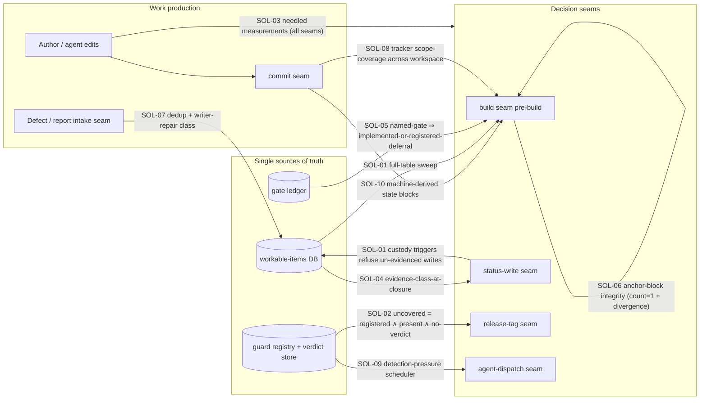
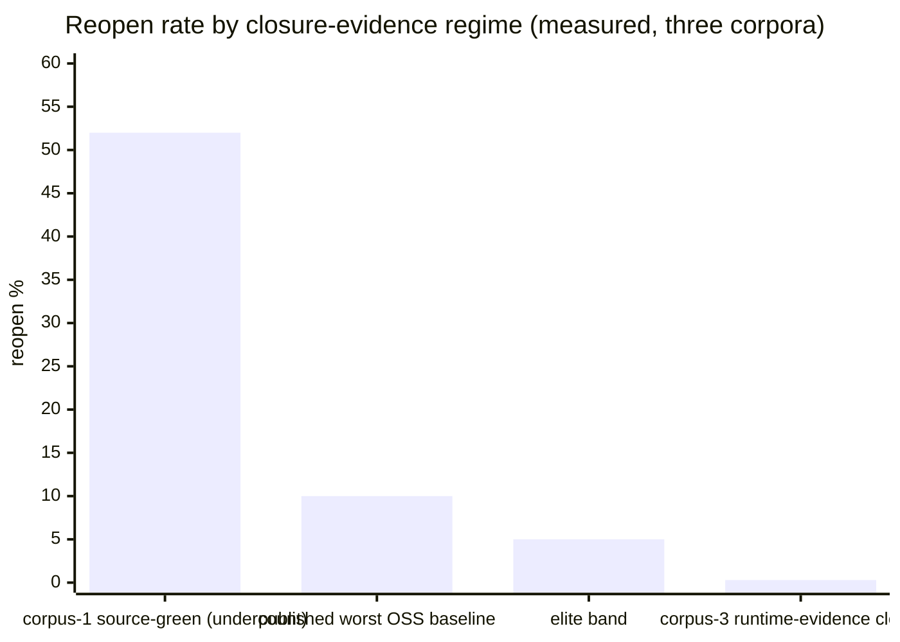
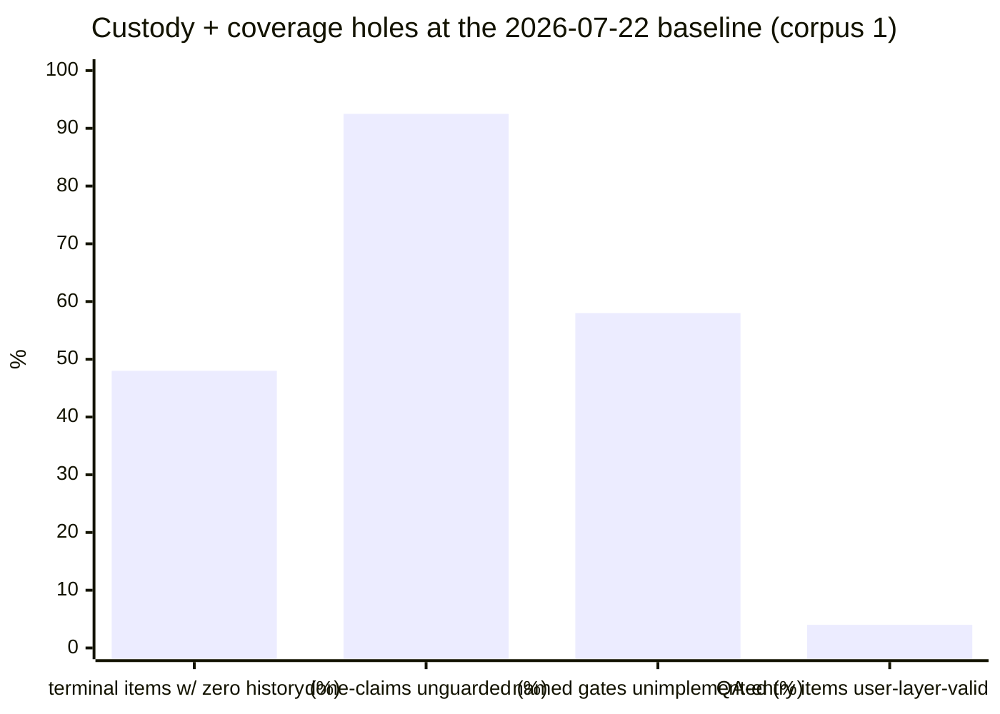

# Solutions — Mechanical Seams, Instruments, and Closable Gaps

| Field | Value |
|---|---|
| Revision | 2 |
| Created | 2026-07-22T20:25:00Z |
| Last modified | 2026-07-22T22:10:00Z |
| Status | COMPLETE — 10 solutions, 10 runnable POCs, all RED-first, 65/65 cases GREEN on a deterministic second iteration (`poc/FULL_SWEEP.txt`) |
| Author | (T1/main - claude4) solutions-synthesis subagent, Fable, §11.4.182 |
| Inputs | `../ROOT_CAUSE_ANALYSIS.md` (PC-1..PC-9, MU-1..MU-6, M1..M19) · `../EXTERNAL_RESEARCH.md` (R1–R7, SYN-1..5, S1–S76 via `../SOURCES.md`) · `../CROSS_PROJECT_CLAUDE_TOOLKIT.md` (corpus 2) · `../CROSS_PROJECT_HELIX_CODE.md` + `../helix_code_repo_classification.tsv` (corpus 3) |
| Mandate | Operator directive 2026-07-22 (verbatim in §0) — exact, rock-solid, non-error-prone, fully safe, risk-free solutions to all causes, with POCs, code, diagrams, stats |
| Classification | universal (§11.4.17) — mechanisms carry no project literals; consumers supply paths/registries as DATA per §11.4.35 |

## 0. The operator's mandate (verbatim)

> "Based on analysis done, materials gathered, knowledge we have acquired, create another deep
> exhaustive documentation under the same directory under subdir called: solutions. There we MUST
> create deep technical documentation with all possible materials, whole POCs, code snippets with
> exact solutions, diagrams, graphs, stats and charts, and all other relevant related materials
> which will represent exact rock-solid, non error prone, fully safe and risk-free solutions to
> all issues and reasons / causes of them so once incorporated we ALWAYS get fully working product
> with no bluff like we used to get so far!"

## 1. The design law every solution obeys (the convergent finding)

Four independent evidence lines (internal forensics; 76-source external literature; corpus 2
without machinery; corpus 3 with machinery) agree on one sentence:

> **Machinery is signal/custody, not prevention. What predicts whether a fix holds is the
> EVIDENCE CLASS AT CLOSURE (runtime vs source) under real DETECTION PRESSURE. Prose does not
> bind; seams do. Coverage has a blind complement at any maturity.**

Therefore **no solution below is a new anchor**. Every solution is a **mechanism at a seam**
(commit / build / status-write / release / dispatch / intake), shipped with working POC code,
golden-good + golden-bad + negative-control fixtures per §11.4.107(10), a RED-before-GREEN
transcript per §11.4.224, a precise statement of the failure it makes IMPOSSIBLE, and an honest
statement of what it still does NOT catch. Where a piece is unproven it is marked so — a
documented gap beats a confident non-solution.

The evidence for "every fully-mechanised rule in the record worked" (ROOT_CAUSE §5.6): the suite
PENDING-semantics + release verdict-coverage seam landed within a day of diagnosis and now block
[M9, M10]; the audited mutation tool's fingerprints made the custody forensics possible; the
control-needle rule caught real traps within days of adoption. The evidence for "anchor #225
fails": 241/413 named gates unimplemented (58%) [M12], 85 explicit gate-code deferrals [M12],
Ontario-null (R6.1, S65), corpus-2 §5 (doctrine in 4 files, zero hooks, zero CI, release shipped
bricked with everything green).

## 2. Seam topology — where the solutions sit

## 3. Ranked solutions by measured leverage

Ranking key: how many of the MEASURED recurrences/false-beliefs in the four inputs the mechanism
would have refused or exposed, weighted by the positive control (the discriminator that held in
both directions across corpora with zero counter-cases). Full rationale per solution in its doc.

| # | Solution | Seam | Closes (causes) | Measured leverage (from the inputs) | POC | Status |
|---|---|---|---|---|---|---|
| 1 | [SOL-01 — Status custody at the database layer](SOL-01_status_custody.md) | status-write + build | PC-1, PC-9, M6 operator-channel | 52/108 terminal items zero-history (48%) [M2]; 13/26 Reopened without event [M4]; R1 4 reopens/0 terminals [M5]; 25/25 reopen events "AI" while 6 operator reopens left NO events [M6]; raw-SQL bypass proven by 3 fingerprints [PC-1] | trigger pack + sweep + fixtures | LANDED |
| 2 | [SOL-04 — Evidence-class-at-closure enforcement](SOL-04_evidence_class.md) | status-write | PC-3, PC-8 (+ the discriminator itself) | 69 PENDING-BUILD claim-moves [M16]; 1/25 items user-layer-validated at QA entry [M14]; corpus-3's ONLY bouncing family = wrong-layer echo-assertion (n=1, sign right, no counter-case); pixel defect "verified" by 5 greps [PC-8] | class-matcher + fixtures | LANDED |
| 3 | [SOL-02 — Coverage-aware verdict semantics at release](SOL-02_verdict_coverage.md) | release-tag | PC-2, PC-7 | 61 guards → 0 PASS/5 FAIL/56 PENDING → exit 0 [M9]; release tooling consulted suite 0 times [M10]; 79 guards never write evidence [M18]; GitHub skipped=Success is the industry-scale same bug (R3.1) | coverage verdict + fixtures | LANDED |
| 4 | [SOL-03 — Needled measurement primitive](SOL-03_needled_measurement.md) | every measurement | PC-5, MU-5, MU-6 | 22 traps/1 cycle, ≥10 corrupted findings, 4 agents [M17]; corpus-2: 6 historical + 2 live instances (§6); live here: pipefail+`grep -q` false-absent **400/400 at 2 MB payload** (0/400 without pipefail); 60 files / 414 exposed sites in the consuming tree | needle lib + SIGPIPE repro + fixtures | LANDED |
| 5 | [SOL-05 — Gate ledger + implementation ratchet](SOL-05_gate_ledger.md) | build | PC-4 | 241/413 named gates unimplemented (58%), 85 explicit deferrals [M12]; custody seam designed 07-17 still unimplemented on 07-22 [M11]; Ontario null (R6.1) | ledger generator + ratchet + fixtures | LANDED |
| 6 | [SOL-07 — Recurrence intake: dedup + writer-repair classification](SOL-07_intake_dedup_writer.md) | intake | PC-6 (+ corpus-2 writer rule) | 15 tickets ≈ 9 root causes [M15]; ≥5 new-id recurrence chains; corpus-2: 11 chains, median 3, max 7 attempts, 38 same-scope <24 h fix-pairs; fossil defect −7 h horizon (§3) | dedup + fix-kind checker + fixtures | LANDED |
| 7 | [SOL-06 — Anchor-block integrity gate](SOL-06_anchor_integrity.md) | build (governance) | M13, MU-4 | two anchors duplicated verbatim-divergently in ALL FOUR mirrors, GREEN under presence≥1 gates [M13 + CLAUDE.md F7]; 1,953 orphan docs; two entry-point mandates contradict [M19] | block-counter + divergence + fixtures | LANDED |
| 8 | [SOL-08 — Tracker scope-coverage gate](SOL-08_scope_coverage.md) | build (workspace) | corpus-3 scope gap (no existing anchor checks it) | ~80% of corpus-3 commit volume (≈11,000 of 13,704 submodule commits → 15 tracked items) ran untracked beside an exemplary tracker (corpus 3 §4.1) | workspace walker + fixtures | LANDED |
| 9 | [SOL-09 — Detection-pressure scheduler](SOL-09_detection_pressure.md) | dispatch/schedule | PC-7 (execution half), §11.4.118 | corpus-3 recurrence latency = 24 days = the NEXT SWEEP not the next use; two standing guards emitted latent FAILs on first real execution [PC-7]; corpus-1 ~0.3%-vs-52% split explained by detection pressure (corpus 3 §5.2) | staleness queue + fixtures | LANDED |
| 10 | [SOL-10 — Misunderstanding-layer mechanics](SOL-10_mu_layer.md) | commit + dispatch | MU-1, MU-2, MU-3, MU-6 (partial) | 22→45 stale design count, stale anchor number consumed in flight [MU-1]; true verdict cited 6 weeks beyond its scope [MU-2]; gate imposed on wrong seam [MU-3]; counts read as state twice in one cycle [MU-6] | state-block verifier + fence linter + fixtures | LANDED |

**Which subset prevents the most measured recurrences:** SOL-01 + SOL-04 + SOL-02 (the custody
chain: no terminal status without class-matched evidence, no release while a registered guard has
no verdict on the candidate). Every measured first-touch escape in the record crossed at least
one of those three seams unimpeded; the positive control (§7 of ROOT_CAUSE) is exactly the
population that had all three de-facto. SOL-03 is the meta-solution — it protects the truth of
every other solution's own measurements. Detailed subset analysis: §5 below.

## 4. Cause → solution coverage matrix

| Cause | Primary solution | Secondary |
|---|---|---|
| PC-1 status-without-custody | SOL-01 | SOL-04 |
| PC-2 absence ≡ verification | SOL-02 | SOL-01 (sweep) |
| PC-3 source-green read as done | SOL-04 | SOL-02 |
| PC-4 rules as prose, not seams | SOL-05 | all (each converts one prose rule to a seam) |
| PC-5 instruments produce false findings | SOL-03 | — |
| PC-6 recurrence fragmentation | SOL-07 | SOL-01 (reopen intake) |
| PC-7 guards never executed | SOL-02 (blocking half) | SOL-09 (execution half) |
| PC-8 wrong-layer oracles | SOL-04 | SOL-02 (class-matched verdicts) |
| PC-9 ambiguous done-vocabulary | SOL-01 + SOL-04 (evidence preconditions per state) | — |
| MU-1 premises inherited without re-measurement | SOL-10 (machine-derived blocks) | SOL-03 |
| MU-2 verdict leaking beyond scope | SOL-10 (citation fencing) | — |
| MU-3 gate on the wrong seam | SOL-10 (seam declaration; honest partial) | SOL-05 |
| MU-4 contradicting canonical rules | SOL-06 | SOL-10 |
| MU-5 right behaviour, wrong mechanism | SOL-03 (mechanism proven by needle before remedy) | — |
| MU-6 counts read as state | SOL-03 (`count ⇒ sample lines`) | SOL-10 |

## 5. Prevented-recurrence analysis, POC results, and stats

### 5.1 POC results (all under `poc/`; every suite RED before its implementation existed)

| POC | Cases | RED transcript | GREEN | Live runs on real data |
|---|---|---|---|---|
| sol01_status_custody | 10/10 | `evidence/RED.txt` (exit 1, 3 missing artifacts) | 10/10 | — (DB-layer; integration is a tracked follow-up) |
| sol02_verdict_coverage | 5/5 | exit 1 | 5/5 | fixture B **replays the exact M9 incident** (61 guards, 5 FAIL, 56 no-verdict): historical exit 0 → POC exit 1 + `uncovered=56` |
| sol03_needled_measurement | 8/8 | exit 1 | 8/8 | pipefail SIGPIPE hazard measured live: **400/400 false-absent at 2 MB** (0/400 without pipefail); exposure census: **60 files / 414 piped `grep -q` sites** in the consuming tree |
| sol04_evidence_class | 5/5 | exit 1 | 5/5 | — |
| sol05_gate_ledger | 7/7 | exit 1 (+ preserved first-GREEN-attempt trap transcript) | 7/7 | **real corpus: 413 named gates (M12 exact), 234 unimplemented** by this instrument (vs M12's 241 — methodological delta stated in SOL-05 §1) |
| sol06_anchor_integrity | 5/5 | exit 1 (+ second RED for the dotted-anchor case) | 5/5 | four mirrors **clean** (F7 reconciliation confirmed held); Constitution.md: **§11.4.140 + §11.4.141 each head two mandates** — the known collision independently re-detected |
| sol07_intake_dedup | 5/5 | exit 1 | 5/5 | negative control encodes the real HXC-052/053 pair |
| sol08_scope_coverage | 5/5 | exit 1 | 5/5 | fixtures are real `git init` repos |
| sol09_detection_pressure | 8/8 | exit 1 | 8/8 | — |
| sol10_mu_layer | 7/7 | exit 1 | 7/7 | fixture S2 replays the MU-1 22-vs-45 case verbatim |
| **Total** | **65/65** | 10× RED-first | **65/65 (iteration 2 identical — §11.4.50)** | 20/20 scripts `bash -n` clean (§11.4.67) |

### 5.2 Live instrument-trap ledger of THIS session (recorded per §11.4.6 — the base rate applies to us too)

| # | Trap | Where | Caught by |
|---|---|---|---|
| 1 | `test \| tee RED.txt; echo exit=$?` recorded **tee's** exit (0) as the test's — the pipeline-exit class, while capturing anti-bluff evidence | SOL-01 RED capture | immediate re-check of the recorded value against the visible RED output |
| 2 | `grep -rlE -- "$g" dir --include='*.sh'` — the `--` terminator turned `--include` into a **filename**; a prose `.md` carrier counted as a gate implementation | SOL-05 first GREEN attempt | the test's own carrier-control case F (transcript preserved: `evidence/GREEN_attempt1_option_terminator_trap.txt`) |
| 3 | anchor-id prefix match: `§11.4.10.A` false-flagged as a duplicate of `§11.4.10` — a §11.4.201(1) false positive in the very tool built against false verdicts | SOL-06 live mirror scan | new failing test case FIRST (`evidence/RED_case_E.txt`), then the extractor fix |
| 4 | (deliberate reproduction) `cat 2MB \| grep -q` under pipefail: present literal read as absent **400/400** | SOL-03 measurement | designed-in; became POC case F1 |

Three accidental traps in one authoring session, by an agent applying §11.4.201 deliberately —
consistent with M17 (22 traps/cycle, 4 agents) and corpus 2 §6.7 (2 live during analysis). The
conclusion is the design law itself: per-measurement controls, not vigilance.

### 5.3 Measured magnitudes the solutions are sized against

*(52% [M3 baseline], 5–10% (R1.1, S1–S5), <10 % elite (R1.6), ~0.3% (corpus 3 §2.3 — a floor
under weak detection pressure, per its own UNKNOWN-1). 48% [M2], 92.5% [M7], 58% [M12], 4% =
1/25 [M14].)*

### 5.4 Which subset would have prevented the most measured recurrences

Walking the measured escape population against the seams:

- **SOL-01 + SOL-04 (status-write custody with class-matched evidence)** intercept: the 52
  zero-history terminal items [M2], the R1 impossible sequence [M5], the 25/25-"AI" attribution
  bias [M6], the 69 PENDING-BUILD claim-moves [M16], the pixel-defect-by-five-greps closure
  [PC-8], and — by construction — the population from which the operator drew the 6/6-broken
  sample: none of those items could have *reached* a terminal status. Corpus-3's natural
  experiment predicts the payoff: where closures carried runtime evidence, median
  attempts-to-stick was 1 and the corrected reopen rate ~0.3%.
- **SOL-02 (release coverage)** intercepts the release-shaped escapes: the M9 exit-0 incident,
  the never-consulted suite [M10], and corpus-2's "fully working" release ~11 h before a total
  field brick — each becomes a refused tag.
- **SOL-03** does not intercept product escapes directly; it protects the measurements the
  other nine make — ≥10 corrupted *findings* in one cycle [M17] is the measured cost of not
  having it, and three live traps in this very session (§5.2) are the demonstration.
- **SOL-07's fix-kind check** intercepts the corpus-2 chain shape (11 chains, median 3
  attempts; the ~7 h fossil horizon): every state-only fix in those chains would have been
  refused as a mitigation at closure.

The honest complement: SOL-05/06/08/09/10 close *systemic* channels (prose-gates, governance
drift, scope holes, latency, premise decay) whose per-incident attribution is diffuse — their
leverage is preventing the *conditions* under which the first four seams get bypassed or
starved.

### 5.5 Consolidated UNPROVEN / gap register (every solution's §5, gathered)

1. UNPROVEN: SOL-01 trigger throughput under ≥10 concurrent writers (§11.4.85 stress owed at integration).
2. UNPROVEN: SOL-07's 50% similarity threshold against the historical 15→9 recurrence set (§11.4.201(8)-style calibration owed).
3. UNPROVEN: SOL-10 checks against real corpus docs — adoption (blocks/fences/declarations) precedes measurement by construction.
4. NOT CLOSED (stated per solution): fabricated evidence rows (SOL-01/04 — mitigated by layering, not eliminated); `DROP TRIGGER` (SOL-01 — detective via tracked-DB diff + sweep); semantic contradiction between different anchors (SOL-06/10 — only the decidable projections are mechanized); textually-dissimilar duplicates below token overlap (SOL-07 — literature says up to 23% of true duplicates); oracle quality everywhere (R1.2/R2.2 — assertions and mutations, not execution, carry detection power).
5. UNKNOWN (inherited from the inputs, unresolvable here): the true corpus-1 reopen rate (PC-6 undercount); whether corpus-3's 341 closures work today (its UNKNOWN-1); the governance-context crowding effect (ROOT_CAUSE §5.1).
6. Per §11.4.205, **nothing in this directory carries force until its seam is wired by a separate tracked work item** — these are proven mechanisms with fixtures, not landed gates. The wiring items are the deliberate next step, and SOL-05's own ledger is the instrument that will keep them from joining the 241.

## 6. Anti-bluff certification for THIS document set

- Every number traces to one of the four inputs (cited as `[M#]`, `PC-#`, `R#.#`, corpus-2 §, corpus-3 §)
  or to a live measurement taken in this session whose command is printed beside it.
- Every reported absence in this session ran a control needle first; `find -newermt` was not used
  anywhere (known-unreliable on this host — ROOT_CAUSE Appendix A instrument notes).
- Every POC ships golden-good / golden-bad / negative-control fixtures; each POC's test was
  written and run RED before the implementation existed (§11.4.224), transcripts under
  `poc/<name>/evidence/`.
- Nothing here edits any governance file, any gate site, the workable-items DB, or any file
  outside `solutions/`. These are POCs + designs; per §11.4.205 they carry no force until their
  seams are wired by a separate, tracked work item — that boundary is stated per solution.
