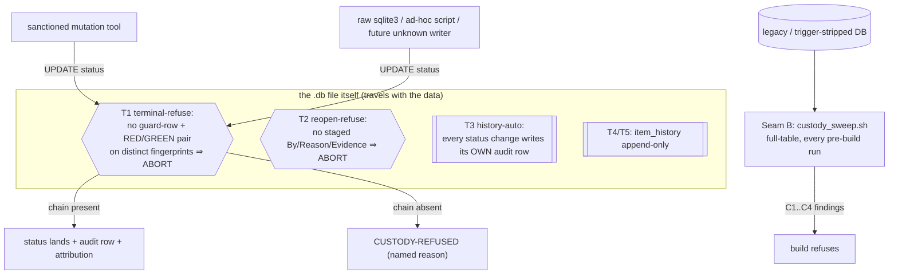

# SOL-01 — Status Custody at the Database Layer

| Field | Value |
|---|---|
| Revision | 1 |
| Last modified | 2026-07-22T20:40:00Z |
| Rank | 1 (highest measured leverage) |
| Closes | PC-1 (status-without-custody), PC-9 (partial — evidence preconditions per state), the M6 operator-reopen recording bias |
| Seams | status-write (Seam A, in-database triggers) + build (Seam B, full-table sweep) |
| POC | [`poc/sol01_status_custody/`](poc/sol01_status_custody/) — GREEN 10/10, RED-first transcript in `evidence/RED.txt` → `evidence/GREEN.txt` |
| Anchors mechanized (no new anchor) | §11.4.146(D3), §11.4.115(F), §11.4.34, §11.4.205 |

## 1. The measured problem this closes

| Measurement | Value | Source |
|---|---|---|
| Terminal-status items with ZERO history rows | **52 / 108 (48%)** | [M2] |
| Currently-Reopened items with no Reopened event | **13 / 26** | [M4] |
| Worst item R1: reopen events / terminal events | **4 / 0** — an impossible sequence proving ledger bypass | [M5] |
| Reopen-event attribution | **25/25 = "AI", 0 = "User"** — while the six operator-driven reopens (the highest-severity escapes in the record) left NO events at all | [M6] |
| Raw-SQL bypass of the sanctioned mutation tool | proven by 3 independent forensic fingerprints | PC-1 |
| Custody seam designed 2026-07-17, status 2026-07-22 | **still prose** — sweep absent, gate absent from both canonical gate sites, ratchet file absent (needled) | [M11] |
| Corpus 3 (best-disciplined corpus): terminal statuses without terminal history events | **~88%** — and its one real reopen got no Reopened event either | corpus 3 §2.1, §2.3 |

The class (ROOT_CAUSE PC-1): *any SSoT writable outside its audited mutation path will, under
deadline pressure, be written outside its audited mutation path.* Corpus 3 proves the failure is
not a discipline problem — the **best**-disciplined corpus in the record still has an 88%
history-gap, because the event-writing seam was advisory there too (§11.4.205 test fails in both
corpora).

## 2. The mechanism

**Move the seam INTO the database file.** Three cooperating layers:



1. **Seam A — refusal triggers in the DB file** (`custody_triggers.sql`). A terminal status
   (`Fixed`/`Implemented`/`Completed`) is *unwritable* unless the custody chain exists AS ROWS:
   registry row keyed by the exact item id → RED verdict (`exit≠0`) → GREEN verdict (`exit=0`)
   on a **different** artifact fingerprint (identical fingerprints = fix never deployed,
   §11.4.115(F)). A `Reopened` flip is unwritable without a staged attribution row
   (By ∈ {AI, User} + Reason + Evidence, §11.4.34).
2. **The historian is the database, not the writer** (trigger T3). Every status change writes
   its own `item_history` row as a side effect of the UPDATE itself. "Status moved with zero
   history rows" becomes *impossible by construction* on a triggered DB — including for raw
   `sqlite3` writers, ad-hoc scripts, and writers that do not exist yet. T4/T5 make the ledger
   append-only.
3. **Seam B — full-table sweep at every build** (`custody_sweep.sh`). Catches what triggers
   cannot: legacy DBs predating the triggers, or DBs whose triggers were dropped (dropping a
   trigger IS possible for a determined writer — see §5). Four checks, each mapped to a measured
   class: C1 = the M2 zero-history class, C2 = the M4 no-reopen-event class, C3 = the M5
   impossible-sequence class, C4 = the M7 unguarded-done class. The sweep control-needles itself
   (an empty/unreadable items table exits 2 `SWEEP-BLIND`, never PASS — §11.4.201(7)(b)).

**Why the database layer and not the tool layer:** PC-1's forensics proved the sanctioned tool
was already structurally incapable of the custody-free write — *and the write happened anyway*,
because the tool is optional and raw SQL is not. A trigger binds every connection to the file.
This is the §11.4.205 "if I documented this and nobody implemented the hook, would anything
catch it?" test answered at the strongest available layer: the enforcement travels **with the
data**, through clones, copies, and CoW tracks.

### The M6 operator-channel fix specifically

The highest-value detection channel (operator reopens — 6/6 of the worst escapes) was the least
recorded (0 events). Under SOL-01 that inverts: the operator (or the agent acting on the
operator's report) stages one row —

```sql
INSERT INTO reopen_intake(atm_id, by_actor, reason, evidence_path)
VALUES('ATM-XXX', 'User', 'manual-testing-detected', 'qa/operator_note.md');
UPDATE items SET status='Reopened' WHERE atm_id='ATM-XXX';
```

— and the flip both *requires* and *consumes* the attribution. No staged row ⇒ the flip itself
fails loudly at the point of work, which is the only moment the attribution is still knowable.

## 3. POC results (all in `poc/sol01_status_custody/`)

RED first (§11.4.224): `evidence/RED.txt` — test run before any implementation existed, exit 1,
3 missing artifacts. Then implementation; `evidence/GREEN.txt` — **10/10 PASS, exit 0**:

| Case | Kind | Result |
|---|---|---|
| A1–A3 | golden-good: full chain → write succeeds, history auto-row, sweep PASS | PASS |
| B1 | golden-bad: raw un-evidenced terminal UPDATE → `CUSTODY-REFUSED` | PASS |
| C1 | golden-bad: legacy DB, terminal item, zero history → sweep FAILs naming the item | PASS |
| D1 | negative-control: ordinary open item → sweep does NOT flag (§11.4.201(1) guard) | PASS |
| E1/E2 | reopen path: un-staged flip refused; staged User flip recorded `by_actor=User` | PASS |
| F1 | append-only ledger: history UPDATE refused | PASS |
| G1 | golden-bad: identical RED/GREEN fingerprints → terminal refused (§11.4.115(F)) | PASS |

## 4. The failure this makes IMPOSSIBLE

On a triggered database:

- A terminal status with no history row **cannot exist** (T3 writes it in the same statement).
- A terminal status without a registered guard + distinct-fingerprint RED/GREEN pair **cannot be
  written** — by any writer, sanctioned or not (T1).
- A reopen without By/Reason/Evidence attribution **cannot be written** (T2) — the M6 bias
  channel (operator reopens leaving no trail) is closed at the only seam it crosses.
- The audit ledger **cannot be edited or pruned** (T4/T5).
- A legacy or trigger-stripped DB **cannot pass the build** while holding any of the four
  measured violation classes (Seam B sweep, wired at pre-build).

Had this existed during the measured window: all 52 zero-history terminal items [M2], the R1
4/0 impossible sequence [M5], and the 25/25-"AI" attribution bias [M6] are refused at write
time; the 6/6-broken operator sample [ROOT_CAUSE §1] becomes structurally impossible to *reach*
because the items could never have carried terminal statuses without verdict pairs.

## 5. What it still does NOT catch (honest boundary, §11.4.6)

1. **Fabricated evidence rows.** A writer can INSERT fake verdict rows (a RED that never ran)
   and then close the item. The triggers verify chain *shape*, not chain *truth* — truth is
   SOL-04's job (evidence-class matching) + SOL-02's (verdicts keyed to real artifact
   fingerprints consumed at release) + the §1.1 mutation discipline (a guard never observed
   failing mints nothing). Layered, not duplicated.
2. **`DROP TRIGGER`.** SQLite has no in-file privilege separation; a determined writer can drop
   the triggers. That act is (a) loud in `git diff` of the tracked DB (§11.4.95 — the DB is
   tracked), (b) caught by Seam B, whose first check on a supposedly-triggered DB can assert
   trigger presence (`SELECT count(*) FROM sqlite_master WHERE type='trigger'` — a consumer
   integration should add this; the POC sweep catches the *consequences* instead). Defense in
   depth, not a wall.
3. **Semantic quality of the closure.** The chain proves custody, not that the guard's oracle is
   calibrated (§11.4.107(10) goldens remain necessary-not-sufficient — §11.4.146(D3) honest
   boundary carried forward verbatim).
4. **The `Obsolete` path** — different evidence shape (obsolete-details), out of POC scope,
   stated here; the same trigger pattern extends to it mechanically.
5. **WAL/concurrency behaviour under many writers** was not stress-tested in this POC
   (UNPROVEN: trigger throughput under 10 concurrent writers; the §11.4.85 stress suite is owed
   at integration time).

## 6. Integration path (separate tracked work item — this POC carries no force per §11.4.205)

1. Apply the trigger pack to the consuming project's tracked DB **in the same commit** as wiring
   `custody_sweep.sh` into the pre-build suite (the §11.4.205 construction order: the executable
   sweep + its golden-bad fixture land WITH the governance text citing them).
2. Adoption of the legacy backlog (52 zero-history items already terminal) is an OPERATOR
   decision per §11.4.66 — options: retro-annotate with `UNATTRIBUTED-LEGACY` history rows, or a
   one-time §11.4.135-style monotone ratchet on C1 findings. Never an invented ratchet.
3. Map real vocabulary (the `(→ Fixed.md)` suffixed literals) and the real verdict store paths
   as consumer DATA (§11.4.35).
