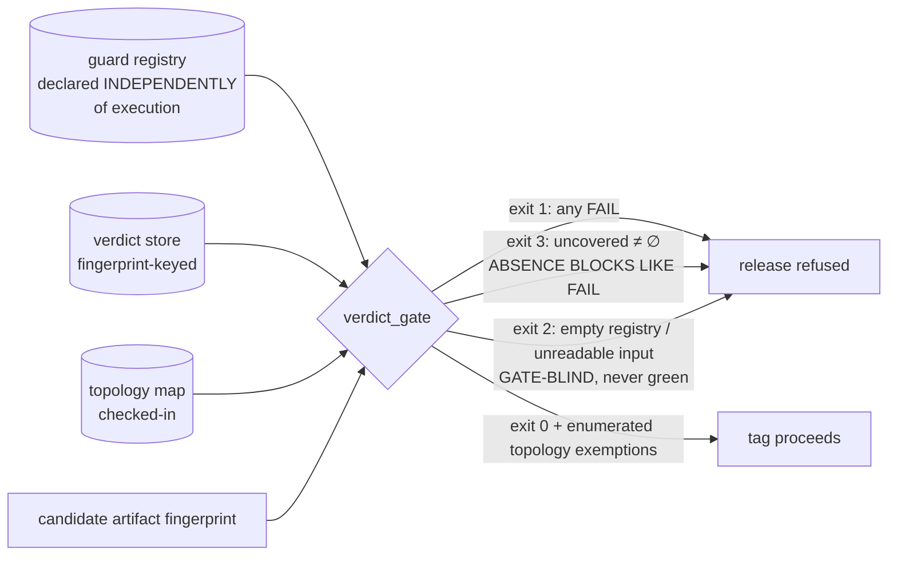

# SOL-02 — Coverage-Aware Verdict Semantics at the Release Seam

| Field | Value |
|---|---|
| Revision | 1 |
| Last modified | 2026-07-22T20:50:00Z |
| Rank | 3 |
| Closes | PC-2 (absence ≡ verification), PC-7 (blocking half — registered-but-never-executed guards can no longer satisfy a release) |
| Seam | release-tag (blocking) · build (advisory reporting of the same computation) |
| POC | [`poc/sol02_verdict_coverage/`](poc/sol02_verdict_coverage/) — GREEN 5/5, RED-first (`evidence/RED.txt` → `evidence/GREEN.txt`) |
| Anchors mechanized (no new anchor) | §11.4.135 (verdict-coverage extension), §11.4.69 `artifact_not_yet_built`, §11.4.3, §11.4.201(1) |

## 1. The measured problem

- The live incident [M9]: **61 registered guards → PASS 0 / FAIL 5 / PENDING 56 → exit 0 "not
  blocked"** — the suite's exit code read only its FAIL count, so "never verified" and
  "verified good" were the same colour.
- The release-tag tooling consulted the guard suite **zero times** [M10] — even the FAIL count
  had no consumer at the moment of tagging.
- 79 guards omit the evidence-init call, so their evidence artifact is silently never written
  [M18] — evidence-absence again reading as no-signal.
- Industry-scale twin (R3.1, S31–S33): **GitHub treats a skipped required status check as
  "Success"** — the identical defect class in the world's largest CI platform, patched by the
  ecosystem with exactly this design (declare the required set independently of execution).
- Corpus 2 limit case: with no registry at all, a release titled "fully working" shipped ~11 h
  before every router alias was measured bricked (corpus 2 §2.3) — nothing enumerated what was
  supposed to have been verified.

## 2. The mechanism

One computation, consumed at two seams:

```
uncovered = registered ∧ topology-present ∧ no-verdict-for-the-CANDIDATE-fingerprint
```



Load-bearing properties, each fixed to a measured failure:

1. **The required set is declared independently of execution** (the registry), so absence is
   computable — the R3.1 lesson. A guard that never ran cannot vanish from the requirement.
2. **Verdicts are keyed to the candidate's artifact fingerprint.** A verdict on an older build
   is *absence* for this candidate (self-clearing, §11.4.135) — closing the PC-3 sub-case where
   re-fixes landed in artifacts that were never flashed while old green carried forward.
3. **Exit vocabulary keeps three states three colours**: FAIL (1) ≠ uncovered (3) ≠ green (0),
   and a blind gate (empty registry, unreadable store) is 2 — *never* 0. The gate
   control-needles its own inputs (§11.4.201(7)(b)).
4. **Topology-absent guards are enumerated exemptions, never blockers and never silence** — the
   POC's negative-control case proves the gate does not commit the §11.4.201(1) FAIL-bluff that
   a flat "PENDING always blocks" would be (the exact framing §11.4.135 rejected).
5. **The release seam must CALL it.** M10's zero-references is why this is specified as a
   blocking call inside the tag tool, not a parallel report. (The consuming project landed this
   wiring 2026-07-18 [M9/M10 remediation column]; the POC generalizes it for every consumer.)

## 3. POC results

`test_sol02.sh`: RED (exit 1, artifact missing) → GREEN **5/5**:

- **B is the exact M9 incident replayed**: 61 registered, 5 FAIL verdicts, 56 no-verdict — the
  historical suite exited 0; the POC exits 1 and reports `uncovered=56`.
- D proves stale-fingerprint verdicts read as absence; E proves topology exemptions are
  enumerated-not-blocking.

## 4. The failure this makes IMPOSSIBLE

A release can no longer be tagged while any registered, topology-present guard lacks a verdict
**on the candidate artifact** — the 0-PASS/56-PENDING/exit-0 state and the "release tool never
asked" state are both unreachable once the tag tool's only path to a tag runs through this gate.
Combined with SOL-01 (an item cannot be *done* without a verdict pair) the two seams close the
pincer: no done-claim without evidence, no release while evidence is missing for the candidate.

## 5. What it still does NOT catch (honest boundary)

1. **Guard quality.** A weak guard with a green verdict passes; oracle strength is SOL-04 +
   §1.1 mutation territory (R1.2/R2.2: execution metrics don't predict detection — checking
   metrics do).
2. **Registry completeness.** `uncovered` is computed against what is *registered*; a defect
   class with no registered guard is invisible here (that is SOL-01's C4 sweep + §11.4.135
   adoption, and discovery pressure is SOL-09/§11.4.118).
3. **Fingerprint integrity.** The gate trusts the candidate fingerprint it is handed; a caller
   passing a stale fingerprint re-opens the hole. Integration must derive the fingerprint from
   the artifact itself (read-from-target, §11.4.115(F)) — stated, not solved here.
4. **The topology map is trusted data.** A wrong map silently exempts a runnable guard; the map
   is checked-in + reviewed (§11.4.135), and exemptions are enumerated in the release changelog
   so a human can catch a wrong one — detective, not preventive.
