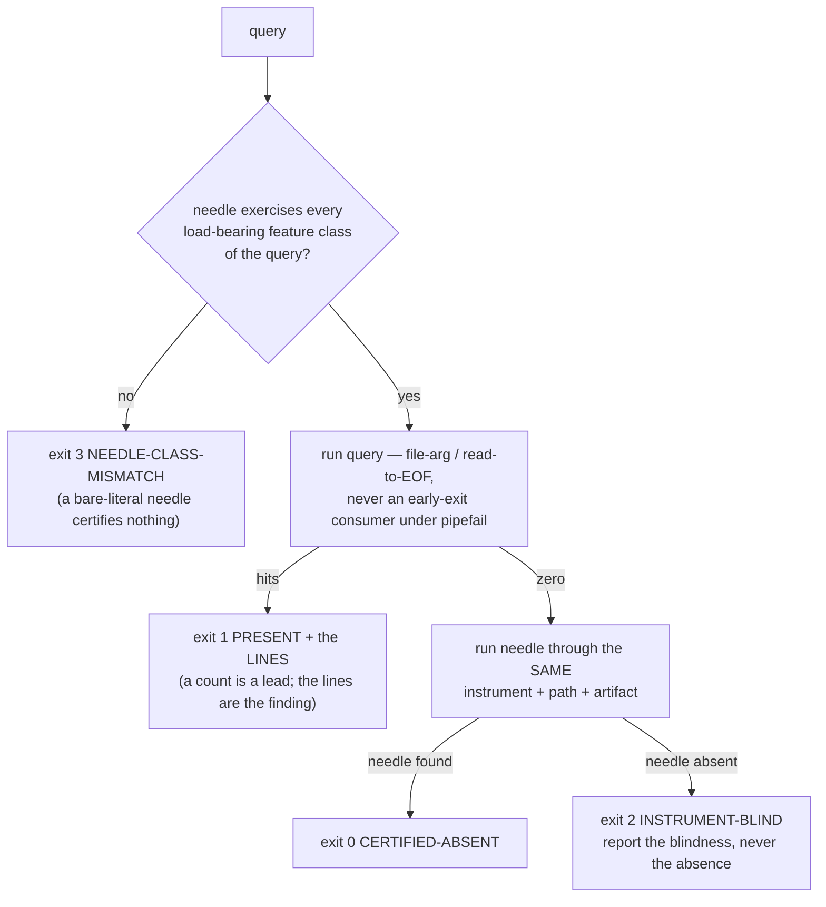

# SOL-03 — The Needled Measurement Primitive

| Field | Value |
|---|---|
| Revision | 1 |
| Last modified | 2026-07-22T20:55:00Z |
| Rank | 4 (and meta — it protects every other solution's own measurements) |
| Closes | PC-5 (instruments produce false findings), MU-5 (wrong mechanism → wrong remedy), MU-6 (counts read as state) |
| Seam | every load-bearing measurement, in every gate/guard/sweep/report |
| POC | [`poc/sol03_needled_measurement/`](poc/sol03_needled_measurement/) — GREEN 8/8, RED-first; the SIGPIPE hazard reproduced INSIDE the test |
| Anchors mechanized (no new anchor) | §11.4.201(6)(7)(8), §11.4.6 |
| Prior art status | The literature has NO named SE discipline for this (EXTERNAL_RESEARCH SYN-3 item 2). Closest prior art: epidemiology's negative/positive-control methodology (R5.3, S60–S62), which independently derives the needle-class-matching condition. |

## 1. The measured problem

- **22 instrument traps catalogued from one release cycle, hit by 4 independent agents; ≥10
  produced *reported findings*, in both directions** [M17]. One environmental root cause (host
  grep is a different regex engine) unified ≥4 "independent" mistakes.
- Corpus 2: **6 historical + 2 live-during-analysis instances** (§6) — swallowed restart
  failures serving the wrong provider while the config read back correct; a test runner with
  silent false-greens; a BRE guard dropping a function; SIGPIPE aborting session resolution; a
  `$`-token eaten from a commit subject; a Verified count off by 111.
- **Live in THIS session (instance #1):** the first RED-evidence capture for SOL-01 recorded
  `exit=0` — the exit status of `tee`, not of the test (pipeline-exit trap). Caught and
  re-captured; recorded here because it demonstrates the base rate even under §11.4.201
  discipline (the same honesty corpus 2 §6.7 practiced).
- **Live measurement, this host, this session** (commands in the POC test):

| Measurement | Result |
|---|---|
| `cat 2MB-payload \| grep -q NEEDLE` under `set -o pipefail`, needle on line 1, 400 iterations | **400/400 read the PRESENT literal as ABSENT** |
| Same, without `pipefail` | 0/400 |
| Files in the consuming tree carrying BOTH `pipefail` and `\| grep -q` | **60 files, 414 piped `grep -q` sites** (scripts/, tests/, constitution/scripts/; control-needled) |

The dispatch brief's figure (8/400, 56 latent sites) was measured earlier at a different payload
size/scope; this session's re-measurement shows the hazard **saturates to deterministic
(400/400) as payload grows** — the worst possible scaling: the bigger the corpus being checked,
the more certainly a present token reads as absent. The 414 sites are the *exposure surface*
(upper bound): a site is only exploitable when the producer writes more than a pipe buffer after
the match — but which sites those are changes with data volume, which is exactly why a per-site
audit cannot close this class and a primitive can.

- External confirmation (R5.1, S53–S56): shell instruments' dominant failure mode is a **clean,
  plausible, wrong answer** — and no strict-mode configuration fixes it; `pipefail` itself
  *introduces* the class above.

## 2. The mechanism

A measurement is never a bare command; it is a **primitive that carries its own controls**:

Four rules, each pinned to a measured failure:

1. **A null is not evidence until a needle traverses the same path** (`nq_absent`) — the M17
   false-null class. Positive control, per R5.3.
2. **The needle must share the query's load-bearing feature classes** (alternation, grouping,
   anchors, escapes — `_nq_features`). A literal needle sails through the dialect layer that is
   eating the query (the host-grep `\|` incident) and would "certify" a blind zero — the exact
   epidemiology validity condition (S62): a control certifies only the error sources it shares.
3. **Presence output carries the lines, not just the count** (MU-6: twice in one cycle a count
   was converted into a finding without reading the lines).
4. **Consumers read producers to EOF** (`nq_stream_contains` uses `grep -c` on a captured
   stream, never `grep -q` on a live pipe) — the SIGPIPE/pipefail class is closed *by
   construction*, not by auditing 414 sites.
5. **The instrument is injectable** (`NQ_GREP`) so the blind-instrument path is itself testable
   — an unfalsifiable validator is unvalidated instrumentation (§11.4.115(F) applied to
   measurements). The POC's golden-bad case injects a see-nothing grep and asserts the primitive
   says `INSTRUMENT-BLIND`, never `CERTIFIED-ABSENT`.

## 3. POC results

RED (missing lib, exit 1) → GREEN **8/8**, including: blind-instrument returns 2 never 0;
carrier prose does not false-match a structure-anchored query (negative control); featureless
needle on an alternation query refused (exit 3) while a class-matched needle certifies; and the
pipefail hazard **reproduced live inside the test** (F1) with the primitive returning PRESENT on
the same payload (F2).

## 4. The failure this makes IMPOSSIBLE

For any measurement routed through the primitive: an **unverified null cannot be reported** —
the API has no code path that emits "absent" without a sighted, class-matched needle; a
SIGPIPE-truncated stream cannot produce a false absence (the producer is always drained); a
blind instrument yields a loud `INSTRUMENT-BLIND`, which is a *finding about the instrument*
(MU-5's requirement: prove the mechanism before choosing the remedy).

## 5. What it still does NOT catch (honest boundary)

1. **False-MATCH beyond structure.** The primitive enforces structure-anchored queries by making
   carriers a first-class test case, but a poorly chosen query pattern can still match a
   carrier; the negative-control fixture discipline (per query class) is the countermeasure, and
   choosing the pattern remains authorship.
2. **Measurements not routed through it.** This is a library, not an interception layer; the 414
   existing sites stay exposed until migrated. Adoption mechanics (a lint that flags bare
   `| grep -q` under pipefail as a migration queue) are a consumer follow-up — a count-visible
   queue, not claimed here.
3. **Non-grep instruments** (jq, awk, sqlite, curl) need the same wrapper pattern per tool; the
   POC ships the grep instance and the design generalizes, but each tool's blind-modes are its
   own (e.g. `find`'s exit-0-on-no-match, `-newermt` host unreliability) — per-tool needles are
   owed at integration.
4. **Feature-class extractor is a closed approximation** — it covers {alternation, group,
   anchors, escapes}; exotic PCRE features are outside the set and would need extending. Stated,
   not hidden.
