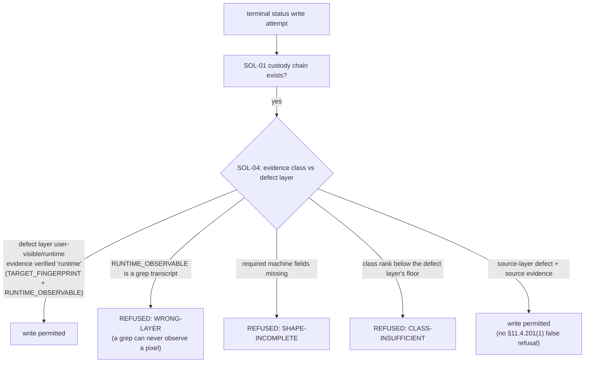

# SOL-04 — Evidence-Class-at-Closure Enforcement (the Discriminator as a Seam)

| Field | Value |
|---|---|
| Revision | 1 |
| Last modified | 2026-07-22T21:05:00Z |
| Rank | 2 (the highest *prevention* leverage — it mechanizes the one predictor that held in every corpus) |
| Closes | PC-3 (source-green read as done), PC-8 (wrong-layer oracles), PC-9 (with SOL-01 — evidence preconditions per status) |
| Seam | status-write (composes with SOL-01: the custody chain's evidence files are class-checked before the terminal write is permitted) |
| POC | [`poc/sol04_evidence_class/`](poc/sol04_evidence_class/) — GREEN 5/5, RED-first |
| Anchors mechanized (no new anchor) | §11.4.115(F) evidence-class clause, §11.4.108 layers, §11.4.123 |

## 1. The measured problem — and the discriminator

The single strongest empirical result across all four inputs:

> **Every fix whose done-claim was preceded by an on-target RED→GREEN polarity flip that held
> recorded ZERO reopens; every fix confirmed at source-green bounced.** (ROOT_CAUSE §7 — the
> positive control; re-verified against the live ledger; no counter-case found in any corpus.)

Cross-corpus confirmation:

| Corpus | Closure evidence class | Outcome |
|---|---|---|
| Corpus 1 (ATMOSphere) | historically source-green | 52% recorded reopen rate (undercount); 6/6 operator-sampled "done" items broken; 69 PENDING-BUILD claim-moves [M16]; QA entered with 1/25 validated past layer 1 [M14] |
| Corpus 2 (claude_toolkit) | hermetic sandbox (wrong layer) | "whole suite green while EVERY router alias on the real host was bricked" (its own forensic note); median 3, max 7 attempts per defect |
| Corpus 3 (helix_code root) | 76% of fix commits cite a test, 46% runtime evidence, closures cite RED→GREEN + mutation | **median attempts-to-stick = 1; ~0.3% git-corrected reopen rate** |
| Corpus 3's ONLY bouncing family | i18n — original PASS was a unit test asserting the Noop echo (wrong-layer oracle) | the corpus's biggest fix (74 packages) AND its only silent reopen — the discriminator's predicted loser, n=1, sign right |

External mechanism (R2.1/R2.2/R2.5, S18/S19/S27): fault-detection power lives in the ORACLE;
execution metrics don't predict detection, checking metrics do; the oracle problem is the
field's named central difficulty. PC-8's canonical instance: a pixel-layer defect "verified" by
a file-existence check plus five greps.

## 2. The mechanism

Make the evidence CLASS a refusable property of the closure, verified by machine fields — never
by a label:

- **Closed sets.** Defect layers {user-visible, runtime, artifact, source}; evidence classes
  {runtime > artifact > source} with a rank floor per layer. Source evidence can close only a
  source-layer item; a user-visible defect requires runtime-class evidence.
- **Class is proven by machine fields**, not asserted: `runtime` requires `TARGET_FINGERPRINT`
  (read from the target, §11.4.115(F)) + `RUNTIME_OBSERVABLE`; `artifact` requires
  `ARTIFACT_PATH` + `ARTIFACT_SHA256`; `source` requires `SOURCE_REF`. A label without its
  fields is `SHAPE-INCOMPLETE`.
- **The anti-echo rule** kills the exact PC-8 shape: a `RUNTIME_OBSERVABLE` that *is* a grep
  transcript is refused as `WRONG-LAYER` — the wrong-layer oracle dies by construction, which is
  precisely what corpus 3's one bouncing family lacked.
- **Composition with SOL-01/SOL-02:** SOL-01 requires the chain to exist; SOL-04 requires its
  evidence to be of the right class; SOL-02 requires it to exist *for the release candidate*.
  Three refusals, one custody pipeline.

## 3. POC results

RED (exit 1, artifact missing) → GREEN **5/5**: real runtime evidence accepted; grep-transcript-
wearing-a-runtime-label refused (`WRONG-LAYER`); fieldless label refused; source-on-source
accepted (negative control — legitimate source-layer work is not false-refused); unreadable
evidence is `BLIND(2)`, never accepted.

## 4. The failure this makes IMPOSSIBLE

A terminal status backed only by source-layer evidence **cannot be written** for a defect whose
layer is runtime/user-visible — the 69 PENDING-BUILD claim-moves [M16], the pixel-defect-by-five-
greps closure [PC-8], and the corpus-2 "sandbox-green, host-bricked" release pattern all cross
this seam and are refused at it. PC-9's ambiguity dissolves as a side effect: each status's
evidence *precondition* is now a checked property, not a vocabulary argument.

## 5. What it still does NOT catch (honest boundary)

1. **Fabricated runtime fields.** A writer can invent `TARGET_FINGERPRINT`. The checker proves
   shape and layer, not provenance; provenance is the §11.4.115(F) harness-written-verdict rule
   (verdict files written by the harness, fingerprint read from the target at run time) +
   SOL-02's candidate-fingerprint join, where an invented fingerprint fails to match the real
   candidate and reads as absence. Layered.
2. **Oracle calibration.** Runtime-class evidence from a mis-calibrated analyzer still passes;
   §11.4.107(10) goldens remain necessary-not-sufficient (stated boundary carried from
   §11.4.146(D3)).
3. **The layer taxonomy is authored data.** Mislabelling a defect as `source`-layer to lower the
   floor is possible; countermeasure is review of the layer field (cheap to spot: the item's
   own description names user symptoms) — detective, not preventive. UNPROVEN: an automatic
   layer classifier from item text was not attempted.
4. **Echo-detection is a closed pattern list** (`grep:` / `source-grep` prefixes in the POC);
   a determined writer can phrase an echo differently. The negative pressure comes from the
   §1.1 mutation pairing (a guard whose evidence cannot fail its golden-bad is refused there),
   not from string-matching alone.
