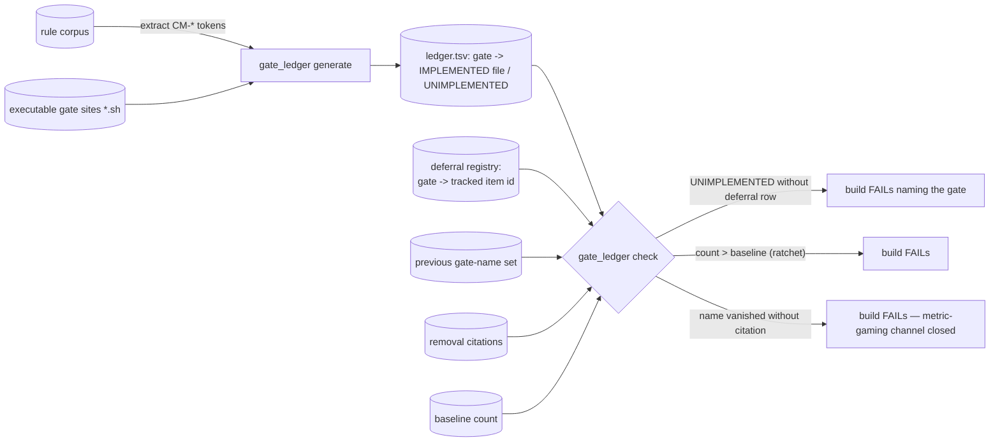

# SOL-05 — Gate Ledger + Implementation Ratchet

| Field | Value |
|---|---|
| Revision | 1 |
| Last modified | 2026-07-22T21:10:00Z |
| Rank | 5 |
| Closes | PC-4 (rules as prose, not seams) — makes a named-but-unimplemented gate a visible, monotonically-decreasing, citation-guarded quantity |
| Seam | build (pre-build gate) + governance-commit (the ledger regenerates and diffs on every corpus edit) |
| POC | [`poc/sol05_gate_ledger/`](poc/sol05_gate_ledger/) — GREEN 7/7, RED-first; **live read-only run against the real corpus reproduced M12** |
| Anchors mechanized (no new anchor) | §11.4.205 (enforced-not-advisory), §11.4.201(8) (metric validated against definition of done), §11.4.75 |

## 1. The measured problem

- **413 named CM-\* gates; 241 (58%) with no implementation in either canonical gate site; 85
  explicit "gate-code = separate work item" deferrals** [M12].
- The custody seam *designed on 2026-07-17* was still prose on 2026-07-22 [M11] — the corpus's
  highest-value remediation itself fell into the same gap within five days.
- The propagation-gate class enforces the presence of anchor **text**, mechanically rewarding
  restatement over implementation (ROOT_CAUSE §5.3) — the corpus measures its health in words
  present, so it grows words.
- External: the Ontario null (R6.1, S65) — mandated checklist adoption without workflow
  embedding produced **no measurable improvement across 101 hospitals**; "every fully-mechanised
  rule in the record worked" is the internal complement (ROOT_CAUSE §5.6).

**Live reproduction with this POC's own instrument** (read-only, this session —
`evidence/live_ledger_constitution.tsv`):

```
named gates extracted from Constitution.md ........ 413   (M12: 413 — exact match)
implemented (token present in an executable site) .. 179
unimplemented ...................................... 234   (M12: 241)
```

The 7-gate delta vs M12 is methodological and stated: this instrument counts a token *anywhere
in an executable file* (including comments) as implemented — a slightly laxer structure rule
than M12's membership sets. Both agree on the headline: **more than half the named enforcement
surface does not exist.**

## 2. The mechanism



1. **Naming a gate becomes a commitment with a same-commit cost**: the moment a `CM-…` token
   lands in the corpus, the ledger regenerates; the new gate is either IMPLEMENTED (token in an
   executable site — prose carriers never count, POC case F) or carries a **registered deferral
   row pointing at a tracked work item**. Silent debt — the current 85-deferral/241-gate state —
   is refused at the build seam.
2. **Monotone ratchet** on the unimplemented count: it may only decrease. Per §11.4.201(8) the
   metric is validated against the definition of done: at the correct end-state (every named
   gate implemented) the count is 0 — the metric reaches target, valid as a necessary floor.
3. **The known gaming channel is closed structurally**: deleting a gate NAME from the corpus
   would lower the count without implementing anything — so the check diffs the gate-name SET
   against the previous run and FAILs on any vanished name lacking an explicit removal citation
   (repeals stay legal and visible — the §11.4.166 pattern; POC cases E/E2).

## 3. POC results

RED → GREEN **7/7**. The first GREEN attempt itself caught a live instrument trap
(`evidence/GREEN_attempt1_option_terminator_trap.txt`): `grep -rlE -- "$g" dir --include='*.sh'`
put the `--include` *after* the `--` option terminator, turning it into a filename — the `.md`
carrier silently counted as an implementation. The §11.4.201(7)(c) path-is-part-of-the-instrument
class reproduced inside the very tool built to expose it; the test's carrier-control case (F)
caught it. Fixed (options before `--`), transcript preserved.

## 4. The failure this makes IMPOSSIBLE

A gate can no longer be named into existence and then not exist: on a wired consumer, every
`CM-…` token is, at every build, either implemented, explicitly deferred to a tracked item, or a
build failure. The 58%-silent state and the "designed five days ago, still prose" state [M11]
are both unrepresentable — debt survives only in its explicit, counted, shrinking form.

## 5. What it still does NOT catch (honest boundary)

1. **Implementation ≠ enforcement quality.** Token-in-an-executable-site proves presence, not
   that the gate asserts the real condition (§11.4.201) or is wired into the suite's exit path.
   The stronger structure rule (a registry function each gate must call, making "implemented"
   = "registered at runtime") is the integration form — this POC's rule is the affordable floor,
   and its laxness is measured above (7 gates of slack on the real corpus).
2. **Deferral registries can accumulate.** A deferral with a tracked item is legal forever under
   this gate; aging pressure on deferrals (e.g. item-age ceilings) is a policy choice the
   operator owns (§11.4.66) — not invented here.
3. **The ledger reads one corpus + one impl tree per invocation**; multi-site consumers compose
   several runs. The live run above copied both real sites into one tree — integration should
   pass the real site list as data (§11.4.35).
4. **Brownfield baseline** (start at 234 and ratchet down, or hard-fail day one) is an operator
   §11.4.66 decision, mirroring §11.4.224(E)'s adoption fence — never an invented ratchet.
