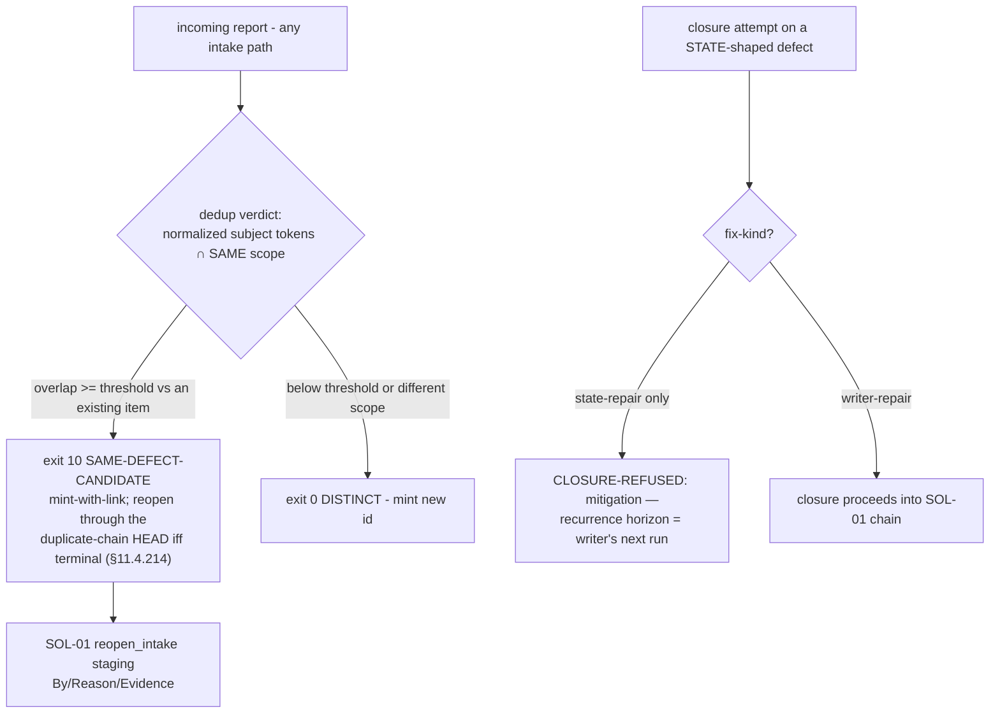

# SOL-07 — Recurrence Intake: Dedup Verdict + Writer-Repair Classification

| Field | Value |
|---|---|
| Revision | 1 |
| Last modified | 2026-07-22T21:40:00Z |
| Rank | 6 |
| Closes | PC-6 (recurrence fragmentation silencing the fragility signal) + the corpus-2 writer-repair rule (value-fix vs invariant-fix) |
| Seam | intake (before an id is minted) + status-write (closure-kind check, composing with SOL-01) |
| POC | [`poc/sol07_intake_dedup/`](poc/sol07_intake_dedup/) — GREEN 5/5, RED-first |
| Anchors mechanized (no new anchor) | §11.4.214 (recurrence-links-not-mints), §11.4.186 keying, corpus-2 §7.3 (writer-repair — distilled, not yet an anchor) |

## 1. The measured problem

- **15 first-touch tickets ≈ 9 root causes; 4 high-confidence recurrences of "done" items
  entered as NEW ids** [M15]; ≥5 recurrence chains re-entered under fresh ids, so the
  reopens-count — the exact signal §11.4.132(d)/§11.4.189 rank fragility by — stayed quiet
  precisely on the items that kept breaking. The 52% reopen rate is a proven undercount [M3].
- Corpus 2 (no tracker): **11 multi-attempt chains, median 3, max 7 attempts; 38 same-scope
  fix→fix pairs within 24 h — half of all fixes were followed within a day by another fix to
  the same subsystem.** "A fix is, empirically, a ~50%-probability hypothesis until it survives
  its first day in the field" (corpus 2 §7.2).
- The fossil case (corpus 2 §3): a **value-fix** (repointed the stored endpoint) held ~7 hours —
  the recurrence horizon of the defective **writer** that kept re-stamping it. Same-day
  siblings: a regen-lost setting, a stale bundled artifact. General law: *a fix that repairs
  the artifact a defective writer produced, without repairing the writer, has a guaranteed
  recurrence horizon equal to the writer's next execution.*
- The false-merge counter-case that bounds the design: one suspected same-defect pair was
  proven **distinct** on close reading [M15]; corpus 3's only fuzzy-title match (HXC-052/053)
  is two genuinely distinct instances of one class in two modules — auto-merge would have
  silently deleted a real defect.
- External baseline (R4.5, S51/S52): tracker duplicate rates run 10–30%, and up to 23% of true
  duplicates are *textually dissimilar* — bare-substring keying is known-broken; the ~40%
  duplication here exceeds every published band.

## 2. The mechanism

1. **Dedup at intake, keyed on normalized `(subject-tokens, scope)`** — never bare substring
   (§11.4.186). The verdict is three-valued by construction: DISTINCT → mint;
   SAME-DEFECT-CANDIDATE → **mint-with-link** (the §11.4.214(3) autonomous default: a spurious
   id is recoverable, a wrongly-merged defect is LOST — the tool never auto-merges); blind
   input → exit 2. Reopening flows through SOL-01's staged-attribution seam, so the restored
   signal is also a custodied signal.
2. **Fix-kind classification at closure**: a defect whose shape is *state* (wrong config value
   / generated artifact / cache entry / route / marker) cannot be closed by a *state-repair*
   alone — the closure is refused with the recurrence-horizon message; `writer-repair`
   (the writer fixed + the state corrected + a seam asserting the invariant) closes normally.
   This is corpus 2's §7.3 rule as a refusing check instead of a distillation.

## 3. POC results

RED → GREEN **5/5**: new item mints; recurrence of a closed overlay defect returns
`SAME-DEFECT-CANDIDATE: ATM-100` (link + reopen-head, not a silent new id); the HXC-052/053
archetype (same class, different scope) stays DISTINCT — the false-merge guard; state+state-
repair closure refused with the horizon message; state+writer-repair closes.

## 4. The failure this makes IMPOSSIBLE

A recurrence can no longer *silently* enter as an unlinked new id through a wired intake path —
every mint above the similarity threshold carries a candidate link, and reopens of terminal
heads increment the counter that feeds risk-ordering. A state-shaped defect can no longer be
marked terminal on a value-fix — the ~7-hour-horizon closure class is refused at the seam.

## 5. What it still does NOT catch (honest boundary)

1. **Textually-dissimilar duplicates** (up to 23% in the literature) fall below any token
   threshold — the tool reduces, not eliminates, fragmentation; the negative pressure for the
   remainder is SOL-09's re-look scheduling plus human triage on the linked candidates.
   UNPROVEN: threshold calibration (50% Jaccard in the POC) against a real corpus — a
   §11.4.201(8)-style calibration run on the historical 15→9 set is owed at integration.
2. **Defect-shape labelling is authored** — declaring a state defect "behaviour" evades the
   fix-kind check; detective countermeasure only (review sees the item description).
3. **Cross-scope recurrences of one defect** (scope moved between modules) read DISTINCT by
   design — the exact trade the HXC-052/053 negative control demands; the linked-candidate
   output for near-threshold cross-scope pairs is a possible extension, not claimed.
