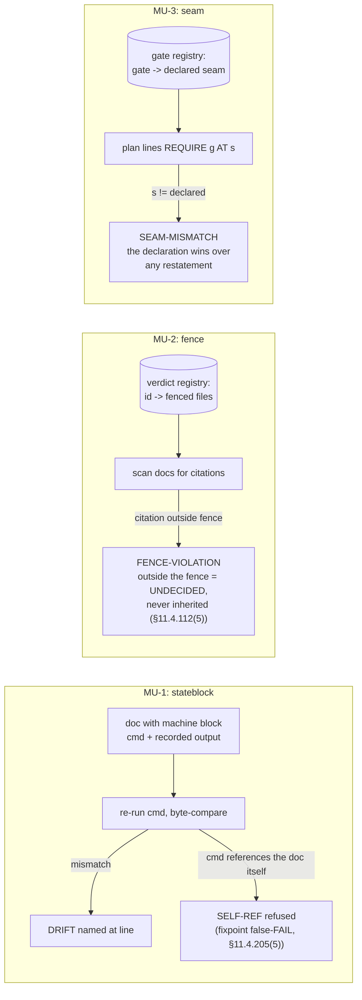

# SOL-10 — Misunderstanding-Layer Mechanics

| Field | Value |
|---|---|
| Revision | 1 |
| Last modified | 2026-07-22T21:55:00Z |
| Rank | 10 |
| Closes | MU-1 (machine-derived state blocks), MU-2 (verdict citation-fencing), MU-3 (seam declarations) — the DECIDABLE subset of the misunderstanding layer; MU-6 shares SOL-03's count⇒lines rule |
| Seam | commit (state blocks + fences in docs) + dispatch (seam check on plans) |
| POC | [`poc/sol10_mu_layer/`](poc/sol10_mu_layer/) — GREEN 7/7, RED-first |
| Anchors mechanized (no new anchor) | §11.4.205(4)(5), §11.4.112(5), §11.4.120 seam-placement clause |

## 1. The measured problem

ROOT_CAUSE §4: misunderstandings are manufactured at **composition seams between honest
components**, and all six shapes worsen superlinearly with corpus volume and session turnover.

- **MU-1** — a design doc asserted "22 edit points"; the measured count at execution was **45**.
  A "next free anchor number" was consumed between measurement and use (duplicate-numbering
  near-miss). A live-state table carried three stale rows. Mechanism: *a fact is measured once,
  becomes text, and text does not expire.*
- **MU-2** — a structurally-TRUE impossibility verdict was cited for **six weeks** against an
  adjacent, viable goal, while the platform's own docs prescribed a public API for that goal.
  The rule fired where verdicts are *minted*; the failure happened where one was *cited*.
- **MU-3** — work was ordered "run E1–E4, then implement P1" while the gate's own definition
  required E2 to run *on a P1-gated build*: a restatement moved the gate from its declared seam
  (enabling) to authorship, manufacturing a deadlock that read as "blocked".

## 2. The mechanism — three refusing checks

1. **`stateblock` (MU-1):** any measured fact carried in a document lives inside a
   machine-derived block declaring its generator command; verification re-runs the generator
   and byte-compares (§11.4.205(4)) — the 22-vs-45 case is a refused commit, not a discovered
   surprise. Blocks whose generator reads the document itself are refused (`SELF-REF`) — the
   real §11.4.205(5) fixpoint bug where a self-fingerprint makes verify a permanent false-FAIL.
2. **`fence` (MU-2):** a verdict's registry row enumerates the files that may cite it; a
   citation anywhere else is a violation naming the citing file. The six-week leak becomes a
   same-day build failure at the first out-of-fence citation.
3. **`seam` (MU-3):** every gate's registry row declares its seam; a plan/dispatch line
   requiring the gate at any other seam (or requiring an unregistered gate) fails. Restatement
   drift of the load-bearing qualifier is caught where it happens — in the restating document.

## 3. POC results

RED → GREEN **7/7**: fresh block verifies; the MU-1 22-vs-45 case reproduced as `DRIFT`;
self-referencing block refused; in-fence citation clean; out-of-fence citation named; declared-
seam plan clean; moved-seam plan `SEAM-MISMATCH`.

## 4. The failure this makes IMPOSSIBLE

A machine-measurable fact carried as prose can no longer silently expire (its block either
re-verifies or fails the commit); a fenced verdict cannot be cited beyond its scope without a
named violation; a plan cannot require a gate at a seam its declaration does not seat it at.

## 5. What it still does NOT catch (honest boundary — the largest of any solution here)

1. **MU-4 semantic contradiction** between anchors remains undecidable in general; only its
   duplication/divergence projection (SOL-06) and these fence/seam projections are mechanized.
2. **MU-5 (wrong mechanism → wrong remedy)** is a reasoning failure; SOL-03's
   `INSTRUMENT-BLIND`-before-remedy discipline narrows it, nothing closes it.
3. **Adoption cost is real:** facts must be *authored into* machine blocks, verdicts *into*
   the registry, gates *into* seam declarations — un-registered instances are invisible to all
   three checks. This is the same declared-set trade every solution here makes; the honest
   statement is that SOL-10 converts unbounded misunderstanding surface into a bounded
   registration discipline, not into zero.
4. **`stateblock` executes embedded generator commands** — integration MUST allowlist the
   command vocabulary before wiring at any seam (an unconstrained `cmd` field is an injection
   surface). Stated in the tool header; not solved in a POC.
5. **UNPROVEN:** none of the three checks has run against the real corpus's docs (the real
   corpus has no machine blocks / fences / seam declarations yet to check — adoption precedes
   measurement, by construction).
